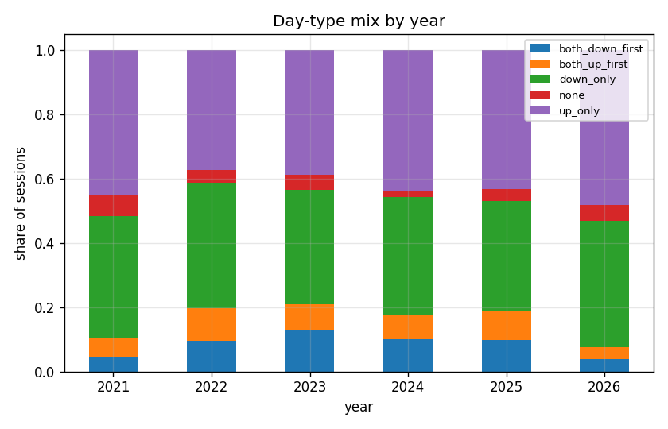
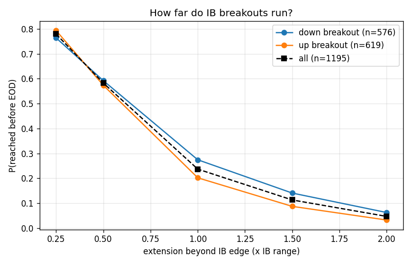
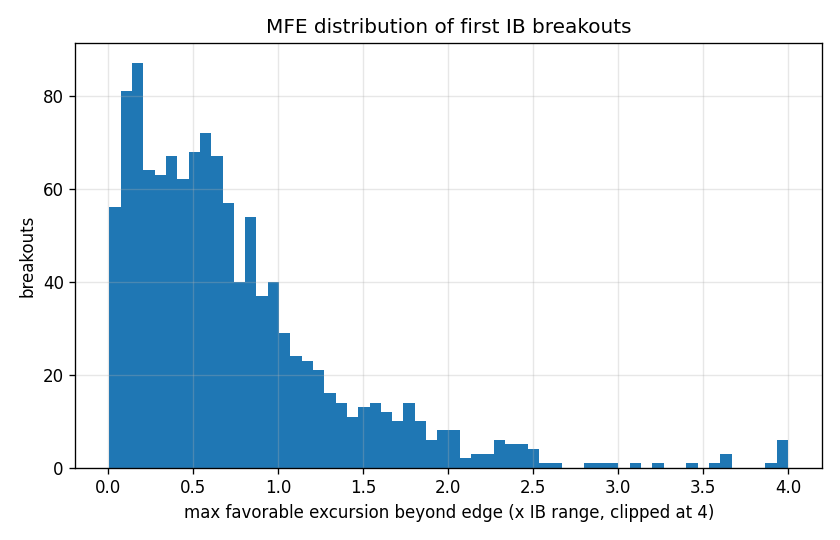
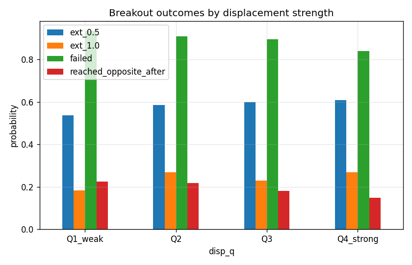
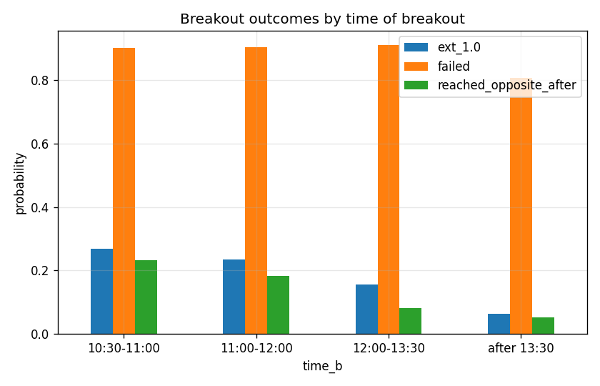

# NQ Initial Balance Probability Study

**Data:** NQ futures 1m, volume-rolled front month, 2021-04-01 to 2026-04-27 (1263 regular sessions, 1195 first-breakout events).

**IB definition:** 9:30-10:30 ET high/low. All distances in *R* = IB range (high minus low). A *breakout* is the first 1-minute close beyond an IB edge after 10:30 ET. *Displacement* = breakout-bar body / average body of the prior 20 bars. *FVG* = 3-candle imbalance near the breakout bar. *CISD* = a later close through the open of the candle sequence that delivered the breakout. Strategy sims resolve same-bar stop/target ambiguity against the trade.

## 1. Day taxonomy

| pattern         |   prob |   n |
|:----------------|-------:|----:|
| up_only         |  0.419 | 529 |
| down_only       |  0.367 | 464 |
| both_down_first |  0.093 | 117 |
| both_up_first   |  0.08  | 101 |
| none            |  0.041 |  52 |

By year:

|   year |   both_down_first |   both_up_first |   down_only |   none |   up_only |
|-------:|------------------:|----------------:|------------:|-------:|----------:|
|   2021 |             0.047 |           0.058 |       0.379 |  0.063 |     0.453 |
|   2022 |             0.096 |           0.1   |       0.392 |  0.04  |     0.372 |
|   2023 |             0.129 |           0.081 |       0.355 |  0.048 |     0.387 |
|   2024 |             0.1   |           0.076 |       0.365 |  0.02  |     0.438 |
|   2025 |             0.097 |           0.093 |       0.34  |  0.036 |     0.433 |
|   2026 |             0.038 |           0.038 |       0.392 |  0.051 |     0.481 |

## 2. Baseline: what happens after the first breakout

|                        |   prob |    n |   ci95 |
|:-----------------------|-------:|-----:|-------:|
| ext_0.25               |  0.779 | 1195 |  0.024 |
| ext_0.5                |  0.582 | 1195 |  0.028 |
| ext_1.0                |  0.237 | 1195 |  0.024 |
| ext_1.5                |  0.113 | 1195 |  0.018 |
| ext_2.0                |  0.047 | 1195 |  0.012 |
| failed                 |  0.896 | 1195 |  0.017 |
| failed_before_05       |  0.803 | 1195 |  0.023 |
| cisd                   |  0.731 | 1195 |  0.025 |
| retest                 |  0.944 | 1195 |  0.013 |
| resumed_after_retest   |  0.808 | 1195 |  0.022 |
| reached_opposite_after |  0.194 | 1195 |  0.022 |
| eod_beyond_edge        |  0.564 | 1195 |  0.028 |

## 3. Conditional probabilities

### By direction

| direction   |   n |   ext_0.25 |   ext_0.5 |   ext_1.0 |   ext_1.5 |   ext_2.0 |   failed |   failed_before_05 |   cisd |   reached_opposite_after |   retest |   resumed_after_retest |   eod_beyond_edge |
|:------------|----:|-----------:|----------:|----------:|----------:|----------:|---------:|-------------------:|-------:|-------------------------:|---------:|-----------------------:|------------------:|
| down        | 576 |      0.764 |     0.592 |     0.274 |     0.141 |     0.062 |    0.91  |              0.812 |  0.736 |                    0.214 |    0.95  |                  0.792 |             0.517 |
| up          | 619 |      0.793 |     0.574 |     0.202 |     0.087 |     0.032 |    0.884 |              0.795 |  0.725 |                    0.176 |    0.939 |                  0.824 |             0.607 |

### By displacement strength

| disp_q    |   n |   ext_0.25 |   ext_0.5 |   ext_1.0 |   ext_1.5 |   ext_2.0 |   failed |   failed_before_05 |   cisd |   reached_opposite_after |   retest |   resumed_after_retest |   eod_beyond_edge |
|:----------|----:|-----------:|----------:|----------:|----------:|----------:|---------:|-------------------:|-------:|-------------------------:|---------:|-----------------------:|------------------:|
| Q1_weak   | 307 |      0.723 |     0.537 |     0.182 |     0.072 |     0.016 |    0.935 |              0.863 |  0.762 |                    0.225 |    0.977 |                  0.899 |             0.534 |
| Q2        | 309 |      0.796 |     0.586 |     0.269 |     0.129 |     0.078 |    0.909 |              0.835 |  0.751 |                    0.217 |    0.948 |                  0.851 |             0.599 |
| Q3        | 297 |      0.788 |     0.599 |     0.229 |     0.101 |     0.04  |    0.896 |              0.811 |  0.737 |                    0.182 |    0.946 |                  0.781 |             0.542 |
| Q4_strong | 282 |      0.812 |     0.61  |     0.27  |     0.152 |     0.053 |    0.84  |              0.695 |  0.667 |                    0.149 |    0.901 |                  0.691 |             0.582 |

### By close-through depth

| close_through_b   |   n |   ext_0.25 |   ext_0.5 |   ext_1.0 |   ext_1.5 |   ext_2.0 |   failed |   failed_before_05 |   cisd |   reached_opposite_after |   retest |   resumed_after_retest |   eod_beyond_edge |
|:------------------|----:|-----------:|----------:|----------:|----------:|----------:|---------:|-------------------:|-------:|-------------------------:|---------:|-----------------------:|------------------:|
| <0.05R            | 789 |      0.736 |     0.53  |     0.194 |     0.087 |     0.037 |    0.918 |              0.859 |  0.744 |                    0.193 |    0.967 |                  0.875 |             0.561 |
| 0.05-0.15R        | 363 |      0.848 |     0.661 |     0.3   |     0.154 |     0.066 |    0.857 |              0.722 |  0.708 |                    0.198 |    0.904 |                  0.697 |             0.57  |
| 0.15-0.30R        |  39 |      0.974 |     0.872 |     0.436 |     0.231 |     0.051 |    0.846 |              0.487 |  0.692 |                    0.179 |    0.872 |                  0.564 |             0.564 |
| >0.30R            |   4 |      1     |     1     |     1     |     0.25  |     0.25  |    0.75  |              0.25  |  0.5   |                    0.25  |    0.75  |                  0.25  |             0.5   |

### FVG present at breakout

| fvg_present   |   n |   ext_0.25 |   ext_0.5 |   ext_1.0 |   ext_1.5 |   ext_2.0 |   failed |   failed_before_05 |   cisd |   reached_opposite_after |   retest |   resumed_after_retest |   eod_beyond_edge |
|:--------------|----:|-----------:|----------:|----------:|----------:|----------:|---------:|-------------------:|-------:|-------------------------:|---------:|-----------------------:|------------------:|
| False         | 257 |      0.689 |     0.494 |     0.214 |     0.089 |     0.031 |    0.981 |              0.934 |  0.875 |                    0.261 |    0.992 |                  0.907 |             0.475 |
| True          | 938 |      0.804 |     0.607 |     0.243 |     0.119 |     0.051 |    0.873 |              0.768 |  0.691 |                    0.176 |    0.931 |                  0.781 |             0.588 |

### By time of breakout

| time_b      |   n |   ext_0.25 |   ext_0.5 |   ext_1.0 |   ext_1.5 |   ext_2.0 |   failed |   failed_before_05 |   cisd |   reached_opposite_after |   retest |   resumed_after_retest |   eod_beyond_edge |
|:------------|----:|-----------:|----------:|----------:|----------:|----------:|---------:|-------------------:|-------:|-------------------------:|---------:|-----------------------:|------------------:|
| 10:30-11:00 | 720 |      0.822 |     0.64  |     0.269 |     0.128 |     0.049 |    0.901 |              0.792 |  0.756 |                    0.232 |    0.949 |                  0.824 |             0.567 |
| 11:00-12:00 | 277 |      0.783 |     0.578 |     0.235 |     0.105 |     0.051 |    0.903 |              0.838 |  0.736 |                    0.184 |    0.949 |                  0.819 |             0.563 |
| 12:00-13:30 | 121 |      0.711 |     0.479 |     0.157 |     0.074 |     0.041 |    0.909 |              0.835 |  0.702 |                    0.083 |    0.926 |                  0.769 |             0.562 |
| after 13:30 |  77 |      0.468 |     0.221 |     0.065 |     0.065 |     0.026 |    0.805 |              0.74  |  0.519 |                    0.052 |    0.909 |                  0.688 |             0.545 |

### By IB width (60-day percentile, quintiles)

| ib_width_q   |   n |   ext_0.25 |   ext_0.5 |   ext_1.0 |   ext_1.5 |   ext_2.0 |   failed |   failed_before_05 |   cisd |   reached_opposite_after |   retest |   resumed_after_retest |   eod_beyond_edge |
|:-------------|----:|-----------:|----------:|----------:|----------:|----------:|---------:|-------------------:|-------:|-------------------------:|---------:|-----------------------:|------------------:|
| narrowest    | 219 |      0.863 |     0.708 |     0.397 |     0.215 |     0.096 |    0.936 |              0.785 |  0.781 |                    0.342 |    0.963 |                  0.822 |             0.543 |
| narrow       | 235 |      0.817 |     0.66  |     0.294 |     0.14  |     0.043 |    0.894 |              0.766 |  0.749 |                    0.213 |    0.945 |                  0.826 |             0.591 |
| mid          | 247 |      0.789 |     0.534 |     0.211 |     0.109 |     0.04  |    0.887 |              0.822 |  0.745 |                    0.174 |    0.939 |                  0.765 |             0.547 |
| wide         | 243 |      0.761 |     0.572 |     0.202 |     0.091 |     0.049 |    0.872 |              0.786 |  0.7   |                    0.16  |    0.942 |                  0.84  |             0.584 |
| widest       | 251 |      0.677 |     0.458 |     0.104 |     0.024 |     0.012 |    0.896 |              0.853 |  0.685 |                    0.1   |    0.932 |                  0.793 |             0.554 |

### By overnight gap

| gap_dir   |   n |   ext_0.25 |   ext_0.5 |   ext_1.0 |   ext_1.5 |   ext_2.0 |   failed |   failed_before_05 |   cisd |   reached_opposite_after |   retest |   resumed_after_retest |   eod_beyond_edge |
|:----------|----:|-----------:|----------:|----------:|----------:|----------:|---------:|-------------------:|-------:|-------------------------:|---------:|-----------------------:|------------------:|
| flat      | 165 |      0.788 |     0.588 |     0.236 |     0.121 |     0.042 |    0.903 |              0.782 |  0.752 |                    0.212 |    0.952 |                  0.782 |             0.527 |
| gap_down  | 463 |      0.773 |     0.577 |     0.212 |     0.089 |     0.03  |    0.901 |              0.81  |  0.745 |                    0.188 |    0.948 |                  0.81  |             0.553 |
| gap_up    | 567 |      0.781 |     0.586 |     0.257 |     0.131 |     0.062 |    0.891 |              0.804 |  0.713 |                    0.194 |    0.938 |                  0.815 |             0.584 |

### By day of week

| dow_name   |   n |   ext_0.25 |   ext_0.5 |   ext_1.0 |   ext_1.5 |   ext_2.0 |   failed |   failed_before_05 |   cisd |   reached_opposite_after |   retest |   resumed_after_retest |   eod_beyond_edge |
|:-----------|----:|-----------:|----------:|----------:|----------:|----------:|---------:|-------------------:|-------:|-------------------------:|---------:|-----------------------:|------------------:|
| Fri        | 236 |      0.78  |     0.593 |     0.25  |     0.093 |     0.038 |    0.907 |              0.788 |  0.699 |                    0.161 |    0.941 |                  0.814 |             0.585 |
| Mon        | 225 |      0.729 |     0.507 |     0.182 |     0.062 |     0.031 |    0.898 |              0.836 |  0.742 |                    0.178 |    0.96  |                  0.809 |             0.524 |
| Thu        | 242 |      0.806 |     0.583 |     0.227 |     0.12  |     0.07  |    0.897 |              0.81  |  0.736 |                    0.198 |    0.942 |                  0.818 |             0.583 |
| Tue        | 246 |      0.78  |     0.585 |     0.26  |     0.134 |     0.037 |    0.87  |              0.797 |  0.724 |                    0.175 |    0.931 |                  0.793 |             0.602 |
| Wed        | 246 |      0.797 |     0.638 |     0.26  |     0.15  |     0.057 |    0.911 |              0.789 |  0.752 |                    0.256 |    0.947 |                  0.809 |             0.524 |

### Opposite side touched before the breakout

| opposite_touched_first   |    n |   ext_0.25 |   ext_0.5 |   ext_1.0 |   ext_1.5 |   ext_2.0 |   failed |   failed_before_05 |   cisd |   reached_opposite_after |   retest |   resumed_after_retest |   eod_beyond_edge |
|:-------------------------|-----:|-----------:|----------:|----------:|----------:|----------:|---------:|-------------------:|-------:|-------------------------:|---------:|-----------------------:|------------------:|
| False                    | 1164 |      0.776 |     0.582 |     0.236 |     0.113 |     0.048 |    0.897 |              0.807 |  0.735 |                    0.197 |    0.944 |                  0.811 |             0.565 |
| True                     |   31 |      0.903 |     0.613 |     0.258 |     0.129 |     0     |    0.871 |              0.677 |  0.548 |                    0.097 |    0.935 |                  0.71  |             0.516 |

## 4. CISD (failed-breakout reversal)

|                                       |   prob |    n |
|:--------------------------------------|-------:|-----:|
| P(CISD | breakout)                    |  0.731 | 1195 |
| P(reach IB mid | CISD)                |  0.611 |  873 |
| P(reach opposite side | CISD)         |  0.266 |  873 |
| P(reach opposite side | no CISD)      |  0     |  322 |
| P(reach opposite side | any breakout) |  0.194 | 1195 |

By displacement of the original breakout (joint probabilities, i.e. P(CISD and outcome | breakout)):

| disp_q    |   n |   cisd |   cisd_then_mid |   cisd_then_opposite |
|:----------|----:|-------:|----------------:|---------------------:|
| Q1_weak   | 307 |  0.762 |           0.495 |                0.225 |
| Q2        | 309 |  0.751 |           0.447 |                0.217 |
| Q3        | 297 |  0.737 |           0.444 |                0.182 |
| Q4_strong | 282 |  0.667 |           0.394 |                0.149 |

## 5. Fair value gaps

|                                      |   prob |    n |
|:-------------------------------------|-------:|-----:|
| P(FVG forms at breakout)             |  0.785 | 1195 |
| P(price revisits FVG | FVG)          |  0.937 |  938 |
| P(FVG holds -> 0.5R ext | revisited) |  0.14  |  879 |
| P(reach 1R ext | FVG)                |  0.243 |  938 |
| P(reach 1R ext | no FVG)             |  0.214 |  257 |
| P(failed | FVG)                      |  0.873 |  938 |
| P(failed | no FVG)                   |  0.981 |  257 |

### Displacement x FVG joint table

|                      |   ('ext_0.5', 'mean') |   ('ext_0.5', 'size') |   ('ext_1.0', 'mean') |   ('ext_1.0', 'size') |   ('failed', 'mean') |   ('failed', 'size') |   ('reached_opposite_after', 'mean') |   ('reached_opposite_after', 'size') |
|:---------------------|----------------------:|----------------------:|----------------------:|----------------------:|---------------------:|---------------------:|-------------------------------------:|-------------------------------------:|
| ('Q1_weak', False)   |                 0.509 |                   114 |                 0.158 |                   114 |                0.974 |                  114 |                                0.263 |                                  114 |
| ('Q1_weak', True)    |                 0.554 |                   193 |                 0.197 |                   193 |                0.912 |                  193 |                                0.202 |                                  193 |
| ('Q2', False)        |                 0.518 |                    85 |                 0.294 |                    85 |                0.976 |                   85 |                                0.224 |                                   85 |
| ('Q2', True)         |                 0.612 |                   224 |                 0.259 |                   224 |                0.884 |                  224 |                                0.214 |                                  224 |
| ('Q3', False)        |                 0.41  |                    39 |                 0.179 |                    39 |                1     |                   39 |                                0.333 |                                   39 |
| ('Q3', True)         |                 0.628 |                   258 |                 0.236 |                   258 |                0.88  |                  258 |                                0.159 |                                  258 |
| ('Q4_strong', False) |                 0.474 |                    19 |                 0.263 |                    19 |                1     |                   19 |                                0.263 |                                   19 |
| ('Q4_strong', True)  |                 0.62  |                   263 |                 0.27  |                   263 |                0.829 |                  263 |                                0.141 |                                  263 |

## 6. Strategy expectancies (R-multiples)

|    | strategy                                 |    n |   win_rate |   avg_R |   median_R |   total_R |   profit_factor |
|---:|:-----------------------------------------|-----:|-----------:|--------:|-----------:|----------:|----------------:|
|  0 | S1 breakout close (stop mid, tgt 1R ext) | 1195 |      0.455 |   0.03  |     -0.239 |    36.089 |           1.064 |
|  1 | S1 + displacement Q4                     |  282 |      0.486 |   0.063 |     -0.05  |    17.864 |           1.148 |
|  2 | S1 + FVG present                         |  938 |      0.489 |   0.089 |     -0.051 |    83.523 |           1.199 |
|  3 | S1 + FVG + disp Q3/Q4                    |  521 |      0.488 |   0.08  |     -0.05  |    41.864 |           1.183 |
|  4 | S1 early (10:30-12:00)                   |  997 |      0.449 |   0.034 |     -0.414 |    33.748 |           1.068 |
|  5 | S1 + narrow IB (bottom 40%)              |  454 |      0.434 |   0.048 |     -0.934 |    21.853 |           1.092 |
|  6 | S1 + wide IB (top 40%)                   |  494 |      0.488 |   0.044 |     -0.042 |    21.494 |           1.106 |
|  7 | S2 retest limit at edge (tgt 0.5R ext)   | 1128 |      0.519 |   0.037 |      0.159 |    41.508 |           1.086 |
|  8 | S2 retest limit at edge (tgt 1R ext)     | 1128 |      0.428 |   0.019 |     -0.459 |    21.888 |           1.039 |
|  9 | S2 (0.5R) + FVG present                  |  873 |      0.542 |   0.072 |      0.259 |    62.56  |           1.176 |
| 10 | S2 (0.5R) + displacement Q3/Q4           |  535 |      0.523 |   0.044 |      0.19  |    23.566 |           1.105 |
| 11 | S3 CISD fade to opposite edge            |  869 |      0.362 |  -0.018 |     -1     |   -15.501 |           0.969 |
| 12 | S3 + weak breakout (disp Q1/Q2)          |  464 |      0.366 |   0.04  |     -1     |    18.758 |           1.069 |
| 13 | S3 + early CISD (<60m after breakout)    |  657 |      0.326 |  -0.005 |     -1     |    -3.59  |           0.992 |

*S1 = market entry on breakout close, stop IB mid, target 1R extension. S2 = limit at IB edge on retest, stop IB mid. S3 = fade on CISD close, stop at post-breakout extreme, target opposite edge. EOD flat exit applies to all.*