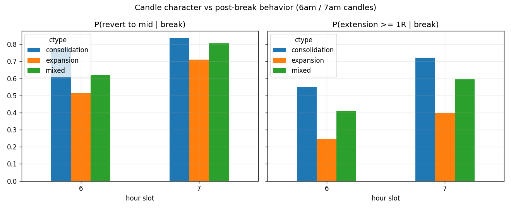
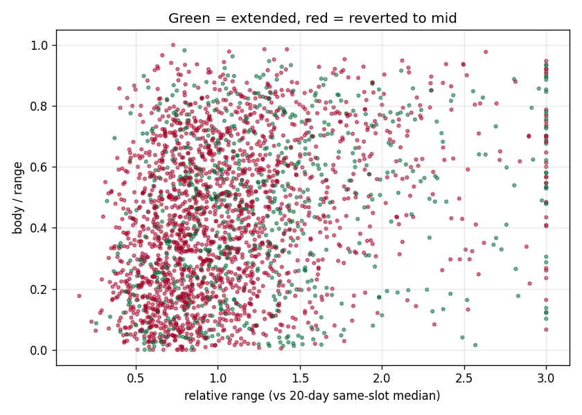

# Candle Character and Mean Reversion to Equilibrium (6am / 7am candles)

2598 candle-sessions; 2574 broke within 120 minutes of completing. All outcome stats condition on a break having occurred. 'Revert' = price returned to the candle midpoint after the first break; 'revert before 0.5R ext' = the midpoint traded before price extended half a range beyond the broken edge (the race that matters for fades).

## baseline_by_slot

|   slot |    n |   P(break) |   P(revert to mid | break) |   P(revert before 0.5R ext) |   P(ext >= 0.5R) |   P(ext >= 1R) |   median ext |   median retrace |
|-------:|-----:|-----------:|---------------------------:|----------------------------:|-----------------:|---------------:|-------------:|-----------------:|
|      6 | 1278 |      0.983 |                    0.64241 |                    0.453834 |            0.666 |          0.415 |        0.823 |            0.759 |
|      7 | 1296 |      0.998 |                    0.79321 |                    0.537037 |            0.777 |          0.584 |        1.237 |            1.228 |

## by_ctype

| ctype         |    n |   P(break) |   P(revert to mid | break) |   P(revert before 0.5R ext) |   P(ext >= 0.5R) |   P(ext >= 1R) |   median ext |   median retrace |
|:--------------|-----:|-----------:|---------------------------:|----------------------------:|-----------------:|---------------:|-------------:|-----------------:|
| consolidation |  619 |        nan |                   0.806139 |                    0.523425 |            0.796 |          0.633 |        1.439 |            1.277 |
| expansion     |  481 |        nan |                   0.621622 |                    0.482328 |            0.595 |          0.328 |        0.676 |            0.706 |
| mixed         | 1474 |        nan |                   0.713026 |                    0.488467 |            0.732 |          0.501 |        1     |            1.013 |

## by_body_ratio_b

| body_ratio_b   |   n |   P(break) |   P(revert to mid | break) |   P(revert before 0.5R ext) |   P(ext >= 0.5R) |   P(ext >= 1R) |   median ext |   median retrace |
|:---------------|----:|-----------:|---------------------------:|----------------------------:|-----------------:|---------------:|-------------:|-----------------:|
| low            | 859 |        nan |                   0.740396 |                    0.500582 |            0.765 |          0.573 |        1.198 |            1.108 |
| mid            | 857 |        nan |                   0.725788 |                    0.484247 |            0.735 |          0.501 |        1     |            1.042 |
| high           | 858 |        nan |                   0.688811 |                    0.502331 |            0.666 |          0.428 |        0.846 |            0.829 |

## by_rel_range_b

| rel_range_b   |   n |   P(break) |   P(revert to mid | break) |   P(revert before 0.5R ext) |   P(ext >= 0.5R) |   P(ext >= 1R) |   median ext |   median retrace |
|:--------------|----:|-----------:|---------------------------:|----------------------------:|-----------------:|---------------:|-------------:|-----------------:|
| low           | 865 |        nan |                   0.801156 |                    0.522543 |            0.79  |          0.628 |        1.403 |            1.256 |
| mid           | 861 |        nan |                   0.735192 |                    0.484321 |            0.739 |          0.498 |        0.992 |            1.079 |
| high          | 848 |        nan |                   0.616745 |                    0.479953 |            0.636 |          0.373 |        0.737 |            0.716 |

## by_close_dist_b

| close_dist_b   |   n |   P(break) |   P(revert to mid | break) |   P(revert before 0.5R ext) |   P(ext >= 0.5R) |   P(ext >= 1R) |   median ext |   median retrace |
|:---------------|----:|-----------:|---------------------------:|----------------------------:|-----------------:|---------------:|-------------:|-----------------:|
| low            | 851 |        nan |                   0.735605 |                    0.487662 |            0.751 |          0.545 |        1.145 |            1.108 |
| mid            | 860 |        nan |                   0.711628 |                    0.50814  |            0.721 |          0.51  |        1.046 |            0.897 |
| high           | 863 |        nan |                   0.707995 |                    0.491309 |            0.694 |          0.446 |        0.908 |            0.934 |

## by_exp_ratio_b

| exp_ratio_b   |   n |   P(break) |   P(revert to mid | break) |   P(revert before 0.5R ext) |   P(ext >= 0.5R) |   P(ext >= 1R) |   median ext |   median retrace |
|:--------------|----:|-----------:|---------------------------:|----------------------------:|-----------------:|---------------:|-------------:|-----------------:|
| low           | 863 |        nan |                   0.765933 |                    0.506373 |            0.781 |          0.592 |        1.241 |            1.202 |
| mid           | 865 |        nan |                   0.707514 |                    0.480925 |            0.745 |          0.525 |        1.076 |            0.943 |
| high          | 846 |        nan |                   0.680851 |                    0.5      |            0.638 |          0.382 |        0.755 |            0.807 |

## grid_relrange_x_body

|                  |   n |   p_revert |   p_ext1 |
|:-----------------|----:|-----------:|---------:|
| ('low', 'low')   | 409 |   0.787286 |    0.648 |
| ('low', 'mid')   | 271 |   0.841328 |    0.579 |
| ('low', 'high')  | 185 |   0.772973 |    0.654 |
| ('mid', 'low')   | 280 |   0.775    |    0.55  |
| ('mid', 'mid')   | 317 |   0.709779 |    0.479 |
| ('mid', 'high')  | 264 |   0.723485 |    0.466 |
| ('high', 'low')  | 170 |   0.570588 |    0.429 |
| ('high', 'mid')  | 269 |   0.628253 |    0.446 |
| ('high', 'high') | 409 |   0.628362 |    0.301 |

## markov_transitions

|                   |   consolidation |   expansion |   mixed |
|:------------------|----------------:|------------:|--------:|
| 5am consolidation |           0.398 |       0.105 |   0.497 |
| 5am expansion     |           0.114 |       0.236 |   0.651 |
| 5am mixed         |           0.224 |       0.186 |   0.589 |
| 6am consolidation |           0.357 |       0.122 |   0.52  |
| 6am expansion     |           0.114 |       0.288 |   0.598 |
| 6am mixed         |           0.221 |       0.21  |   0.569 |

## by_type_and_prior

|                                    |   n |   p_revert |
|:-----------------------------------|----:|-----------:|
| ('consolidation', 'consolidation') | 232 |   0.801724 |
| ('consolidation', 'expansion')     |  50 |   0.86     |
| ('consolidation', 'mixed')         | 337 |   0.801187 |
| ('expansion', 'consolidation')     |  70 |   0.614286 |
| ('expansion', 'expansion')         | 118 |   0.627119 |
| ('expansion', 'mixed')             | 293 |   0.62116  |
| ('mixed', 'consolidation')         | 314 |   0.726115 |
| ('mixed', 'expansion')             | 286 |   0.674825 |
| ('mixed', 'mixed')                 | 874 |   0.720824 |

