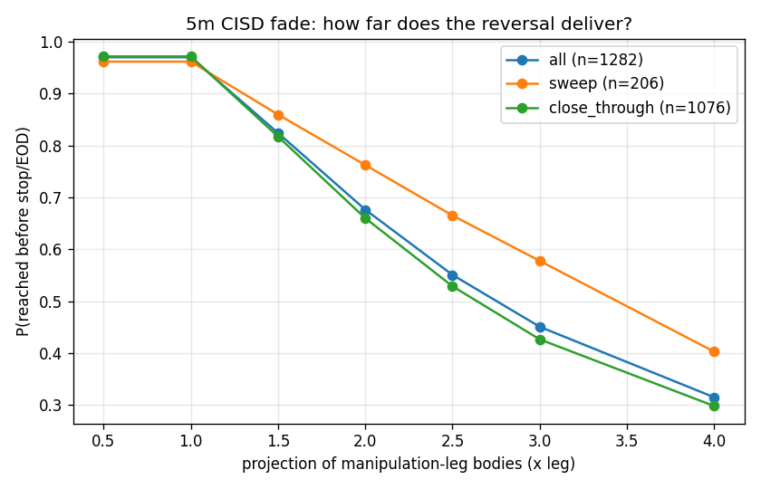
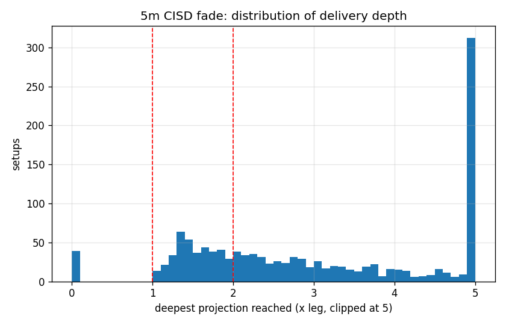

# 5m CISD Fade Study: IB-edge raids, manipulation-leg projections

Setups: 1282 (665 fading upside raids, 617 fading downside raids), one per side per session, first CISD trigger only.

**Definitions.** Raid = post-10:30 trade beyond an IB edge. Manipulation leg = consecutive same-direction 5m closes into the post-raid extreme (re-anchored if a new extreme prints before the trigger). CISD = first 5m close through the leg origin's open; entry at that close, stop at the raid extreme (wick). Projections measured on leg BODIES: leg top = highest body of the run, leg bottom = origin open; level x = leg_top - x * leg_body_size. 1.0x = full body-retrace of the run-up; 2.0x = symmetric extension below it. Same-bar stop+target counts as stop; EOD exits counted as 0R in the strategy table (conservative).

Median risk (entry to stop): 47.2 pts; median leg size 26.2 pts; median entry already 1.29x down the projection scale at trigger.

## Probability of delivering to each projection

|      |         all |      short |       long |      sweep |   close_through |
|:-----|------------:|-----------:|-----------:|-----------:|----------------:|
| 0.5x |    0.969579 |   0.968421 |   0.970827 |   0.961165 |        0.97119  |
| 1.0x |    0.969579 |   0.968421 |   0.970827 |   0.961165 |        0.97119  |
| 1.5x |    0.823713 |   0.846617 |   0.799028 |   0.859223 |        0.816914 |
| 2.0x |    0.676287 |   0.696241 |   0.654781 |   0.762136 |        0.659851 |
| 2.5x |    0.550702 |   0.580451 |   0.518639 |   0.665049 |        0.52881  |
| 3.0x |    0.450858 |   0.47218  |   0.427877 |   0.57767  |        0.42658  |
| 4.0x |    0.315133 |   0.333835 |   0.294976 |   0.402913 |        0.298327 |
| n    | 1282        | 665        | 617        | 206        |     1076        |

## Fixed-target strategy (stop at raid extreme)

|                                |    n |   P(target) |   P(stop) |   P(EOD exit) |   avg_R |   win_rate |   profit_factor |
|:-------------------------------|-----:|------------:|----------:|--------------:|--------:|-----------:|----------------:|
| ('1.5x', 'all')                |  854 |       0.761 |     0.172 |         0.067 |  -0.018 |      0.761 |           0.897 |
| ('1.5x', 'sweep only')         |  115 |       0.8   |     0.113 |         0.087 |   0.01  |      0.8   |           1.092 |
| ('1.5x', 'close-through only') |  739 |       0.755 |     0.181 |         0.064 |  -0.022 |      0.755 |           0.878 |
| ('2.0x', 'all')                | 1091 |       0.632 |     0.266 |         0.103 |  -0.012 |      0.632 |           0.955 |
| ('2.0x', 'sweep only')         |  156 |       0.705 |     0.192 |         0.103 |   0.036 |      0.705 |           1.186 |
| ('2.0x', 'close-through only') |  935 |       0.619 |     0.278 |         0.103 |  -0.02  |      0.619 |           0.929 |
| ('2.5x', 'all')                | 1160 |       0.513 |     0.334 |         0.153 |  -0.026 |      0.513 |           0.922 |
| ('2.5x', 'sweep only')         |  173 |       0.613 |     0.214 |         0.173 |   0.062 |      0.613 |           1.29  |
| ('2.5x', 'close-through only') |  987 |       0.495 |     0.356 |         0.149 |  -0.042 |      0.495 |           0.883 |
| ('3.0x', 'all')                | 1203 |       0.42  |     0.383 |         0.197 |  -0.055 |      0.42  |           0.856 |
| ('3.0x', 'sweep only')         |  185 |       0.535 |     0.259 |         0.205 |   0.044 |      0.535 |           1.169 |
| ('3.0x', 'close-through only') | 1018 |       0.399 |     0.406 |         0.195 |  -0.073 |      0.399 |           0.82  |
| ('4.0x', 'all')                | 1233 |       0.291 |     0.459 |         0.25  |  -0.128 |      0.291 |           0.721 |
| ('4.0x', 'sweep only')         |  191 |       0.361 |     0.377 |         0.262 |  -0.069 |      0.361 |           0.816 |
| ('4.0x', 'close-through only') | 1042 |       0.278 |     0.474 |         0.248 |  -0.139 |      0.278 |           0.707 |

## Conditioned

### by raid_depth_b

| raid_depth_b   |   n |   P(1x) |   P(2x) |   P(stopped) |   median max_proj |
|:---------------|----:|--------:|--------:|-------------:|------------------:|
| shallow        | 428 |   0.965 |   0.699 |        0.591 |             3.048 |
| medium         | 427 |   0.977 |   0.67  |        0.604 |             2.61  |
| deep           | 427 |   0.967 |   0.66  |        0.485 |             2.622 |

### by leg_size_b

| leg_size_b   |   n |   P(1x) |   P(2x) |   P(stopped) |   median max_proj |
|:-------------|----:|--------:|--------:|-------------:|------------------:|
| small leg    | 428 |   0.939 |   0.815 |        0.715 |             4.096 |
| mid leg      | 427 |   0.986 |   0.705 |        0.59  |             2.816 |
| big leg      | 427 |   0.984 |   0.508 |        0.375 |             2.012 |

### by time_b

| time_b       |   n |   P(1x) |   P(2x) |   P(stopped) |   median max_proj |
|:-------------|----:|--------:|--------:|-------------:|------------------:|
| before 11:30 | 470 |   0.972 |   0.745 |        0.677 |             3.181 |
| 11:30-13:00  | 419 |   0.986 |   0.659 |        0.599 |             2.622 |
| after 13:00  | 393 |   0.949 |   0.613 |        0.379 |             2.397 |

### by entry_inside_ib

| entry_inside_ib   |   n |   P(1x) |   P(2x) |   P(stopped) |   median max_proj |
|:------------------|----:|--------:|--------:|-------------:|------------------:|
| False             | 509 |   0.959 |   0.697 |        0.568 |             2.771 |
| True              | 773 |   0.977 |   0.662 |        0.555 |             2.72  |

### by raid_type

| raid_type     |    n |   P(1x) |   P(2x) |   P(stopped) |   median max_proj |
|:--------------|-----:|--------:|--------:|-------------:|------------------:|
| close_through | 1076 |   0.971 |   0.66  |        0.56  |             2.632 |
| sweep         |  206 |   0.961 |   0.762 |        0.558 |             3.336 |

### by side

| side   |   n |   P(1x) |   P(2x) |   P(stopped) |   median max_proj |
|:-------|----:|--------:|--------:|-------------:|------------------:|
| long   | 617 |   0.971 |   0.655 |        0.507 |             2.581 |
| short  | 665 |   0.968 |   0.696 |        0.609 |             2.849 |
