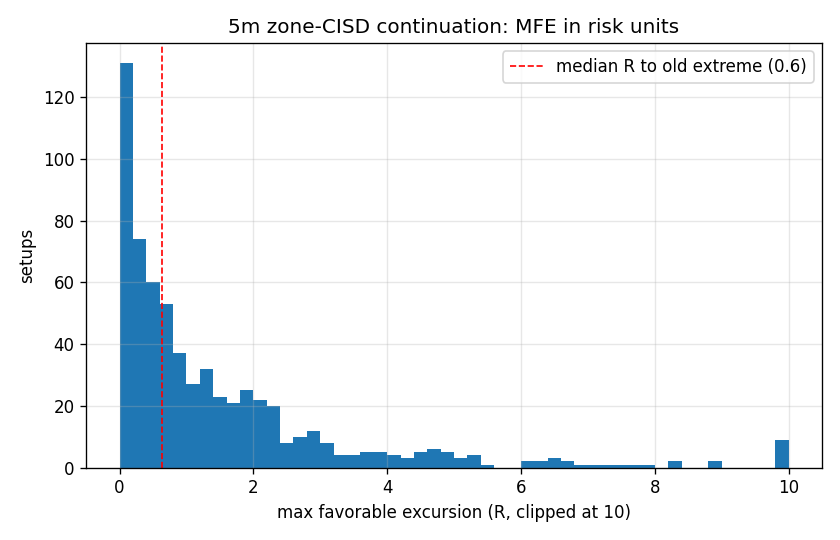
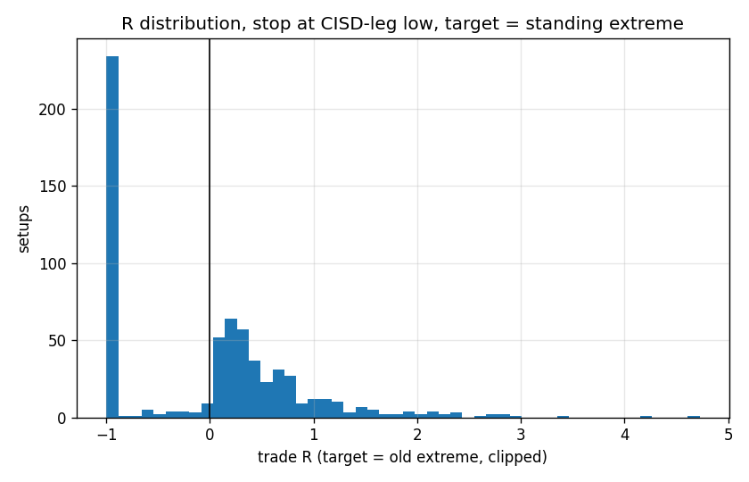

# 5m Continuation CISD in the 25-50% Dealing-Range Zone

Close-through IB breakout -> retracement whose deepest depth sits in 25-50% of the dealing range (session extreme-so-far to trailing post-breakout extreme; episodes that exceed 50% are invalidated until a new extreme resets them) -> first 5m close back through the open of the retracement leg (consecutive counter-direction closes into the episode low, re-anchored on new lows), closing still below the standing extreme. Entry at that close. **Stop at the low of the CISD leg.** Same-bar stop+target counts as stop; EOD exit at the close.

## Summary

|                                       |   value |
|:--------------------------------------|--------:|
| setups                                | 640     |
| P(setup | close-through breakout)     |   0.474 |
| median risk (pts)                     |  38.25  |
| median risk (frac of DR)              |   0.201 |
| median R available to old extreme     |   0.64  |
| median trigger time (min after 10:30) | 140     |
| median depth at trigger               |   0.343 |
| P(stopped before any target)          |   0.366 |
| median MFE (R)                        |   0.82  |

## Fixed targets

| target           |   n |   P(target) |   P(stop first) |   win_rate |   avg_R |   median_R |   profit_factor |
|:-----------------|----:|------------:|----------------:|-----------:|--------:|-----------:|----------------:|
| old extreme      | 640 |       0.558 |           0.366 |      0.594 |  -0.002 |       0.15 |           0.995 |
| extreme +0.25 DR | 640 |       0.27  |           0.509 |      0.427 |   0.108 |      -1    |           1.204 |
| extreme +0.5 DR  | 640 |       0.141 |           0.55  |      0.383 |   0.154 |      -1    |           1.27  |

## Conditioned

### by direction

| direction   |   n |   P(old extreme) |   P(+0.5 DR) |   P(stop first) |   avg_R (old extreme) |   avg_R (+0.5 DR) |
|:------------|----:|-----------------:|-------------:|----------------:|----------------------:|------------------:|
| down        | 331 |            0.544 |        0.157 |           0.405 |                -0.014 |             0.163 |
| up          | 309 |            0.573 |        0.123 |           0.324 |                 0.011 |             0.145 |

### by time_b

| time_b      |   n |   P(old extreme) |   P(+0.5 DR) |   P(stop first) |   avg_R (old extreme) |   avg_R (+0.5 DR) |
|:------------|----:|-----------------:|-------------:|----------------:|----------------------:|------------------:|
| 10:30-11:00 | 371 |            0.555 |        0.146 |           0.396 |                -0.06  |             0.045 |
| 11:00-12:00 | 138 |            0.587 |        0.152 |           0.341 |                 0.022 |             0.251 |
| after 12:00 | 131 |            0.534 |        0.115 |           0.305 |                 0.138 |             0.362 |

### by depth_b

| depth_b   |   n |   P(old extreme) |   P(+0.5 DR) |   P(stop first) |   avg_R (old extreme) |   avg_R (+0.5 DR) |
|:----------|----:|-----------------:|-------------:|----------------:|----------------------:|------------------:|
| 25-37.5%  | 415 |            0.578 |        0.13  |           0.361 |                -0.032 |             0.102 |
| 37.5-50%  | 223 |            0.516 |        0.152 |           0.377 |                 0.045 |             0.203 |
