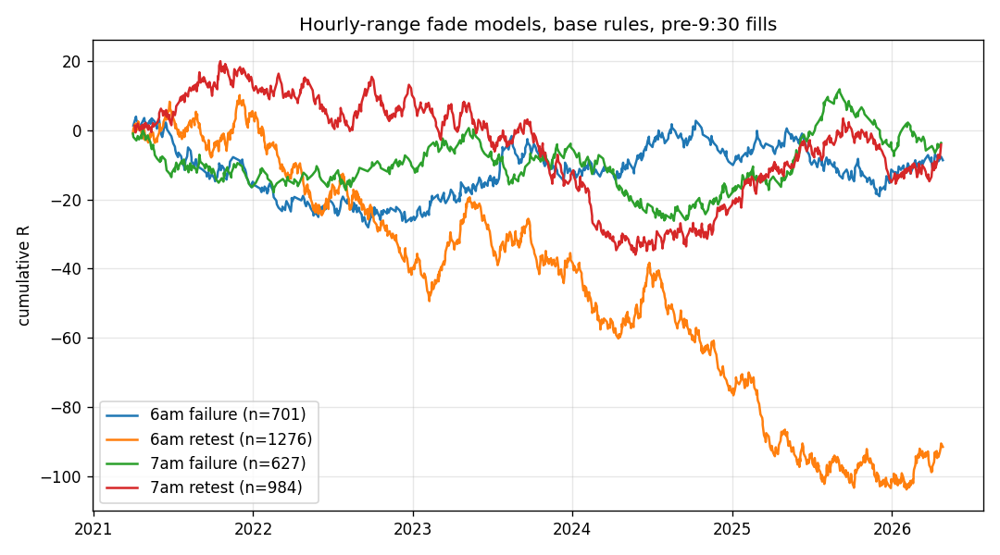
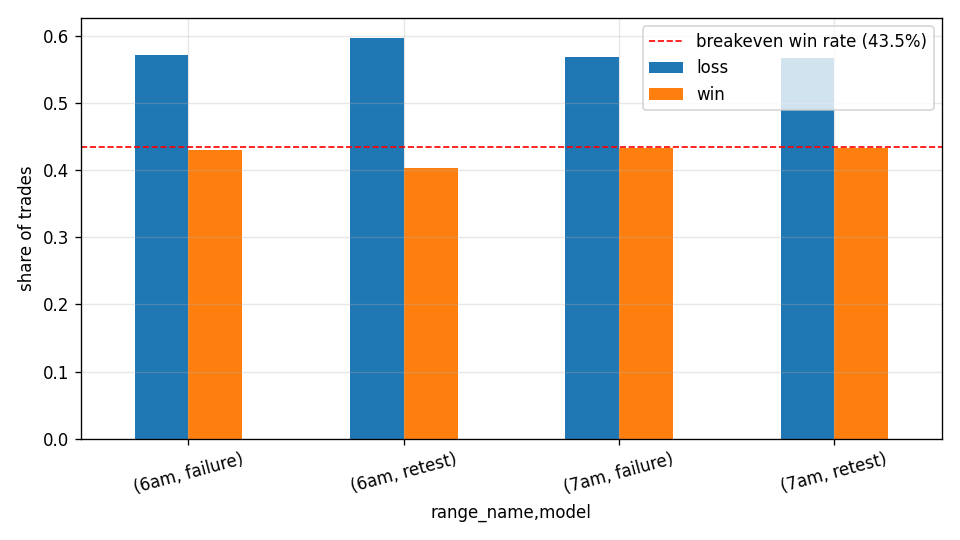

# Hourly-Range Fade Models on NQ 1m (6-7am and 7-8am ET candles)

4937 trades detected, 3588 with pre-9:30 fills (base case). Win = +1.3R, loss = -1R (stop = target distance / 1.3); EOD exits at the 16:00 close. A bar that touches the midpoint and the level together counts as a cancel, and same-bar stop+target counts as stop (both conservative). Breakeven win rate at 1.3:1 is 43.5%.

## Base rules, pre-9:30 fills

|                    |    n |   win_rate |   loss_rate |   eod_rate |   avg_R |   total_R |   profit_factor |   median_stop_pts |   median_mins_to_exit |
|:-------------------|-----:|-----------:|------------:|-----------:|--------:|----------:|----------------:|------------------:|----------------------:|
| ('6am', 'failure') |  701 |      0.429 |       0.571 |          0 |  -0.012 |      -8.7 |           0.978 |            12.212 |                    12 |
| ('6am', 'retest')  | 1276 |      0.404 |       0.596 |          0 |  -0.072 |     -91.5 |           0.88  |            12.788 |                    13 |
| ('7am', 'failure') |  627 |      0.432 |       0.568 |          0 |  -0.006 |      -3.7 |           0.99  |            13.462 |                    12 |
| ('7am', 'retest')  |  984 |      0.433 |       0.567 |          0 |  -0.004 |      -4.2 |           0.992 |            14.183 |                    12 |

## With breakeven stop once the 25% level trades

|                    |    n |   win_rate |   loss_rate |   eod_rate |   avg_R |   total_R |   profit_factor |   median_stop_pts |   median_mins_to_exit |
|:-------------------|-----:|-----------:|------------:|-----------:|--------:|----------:|----------------:|------------------:|----------------------:|
| ('6am', 'failure') |  701 |      0.429 |       0.571 |          0 |  -0.038 |     -26.6 |           0.906 |            12.212 |                    12 |
| ('6am', 'retest')  | 1276 |      0.404 |       0.596 |          0 |  -0.074 |     -95   |           0.823 |            12.788 |                    13 |
| ('7am', 'failure') |  627 |      0.432 |       0.568 |          0 |  -0.02  |     -12.7 |           0.951 |            13.462 |                    12 |
| ('7am', 'retest')  |  984 |      0.433 |       0.567 |          0 |   0.018 |      18   |           1.047 |            14.183 |                    12 |

## All fills allowed (entries any time before 16:00)

|                    |    n |   win_rate |   loss_rate |   eod_rate |   avg_R |   total_R |   profit_factor |   median_stop_pts |   median_mins_to_exit |
|:-------------------|-----:|-----------:|------------:|-----------:|--------:|----------:|----------------:|------------------:|----------------------:|
| ('6am', 'failure') |  859 |      0.411 |       0.587 |      0.002 |  -0.054 |   -46.004 |           0.909 |            12.885 |                    10 |
| ('6am', 'retest')  | 1675 |      0.398 |       0.599 |      0.002 |  -0.082 |  -137.11  |           0.864 |            13.269 |                    10 |
| ('7am', 'failure') |  855 |      0.423 |       0.571 |      0.006 |  -0.02  |   -17.267 |           0.965 |            14.615 |                     8 |
| ('7am', 'retest')  | 1548 |      0.422 |       0.574 |      0.004 |  -0.025 |   -38.964 |           0.956 |            15.192 |                     7 |

## By side (base)

|                             |   n |   win_rate |   loss_rate |   eod_rate |   avg_R |   total_R |   profit_factor |   median_stop_pts |   median_mins_to_exit |
|:----------------------------|----:|-----------:|------------:|-----------:|--------:|----------:|----------------:|------------------:|----------------------:|
| ('6am', 'failure', 'long')  | 322 |      0.429 |       0.571 |          0 |  -0.014 |      -4.6 |           0.975 |            12.308 |                    11 |
| ('6am', 'failure', 'short') | 379 |      0.43  |       0.57  |          0 |  -0.011 |      -4.1 |           0.981 |            12.212 |                    13 |
| ('6am', 'retest', 'long')   | 593 |      0.411 |       0.589 |          0 |  -0.054 |     -31.8 |           0.909 |            12.885 |                    12 |
| ('6am', 'retest', 'short')  | 683 |      0.397 |       0.603 |          0 |  -0.087 |     -59.7 |           0.855 |            12.596 |                    13 |
| ('7am', 'failure', 'long')  | 307 |      0.446 |       0.554 |          0 |   0.026 |       8.1 |           1.048 |            13.654 |                    11 |
| ('7am', 'failure', 'short') | 320 |      0.419 |       0.581 |          0 |  -0.037 |     -11.8 |           0.937 |            13.365 |                    13 |
| ('7am', 'retest', 'long')   | 483 |      0.427 |       0.573 |          0 |  -0.019 |      -9.2 |           0.967 |            13.75  |                    12 |
| ('7am', 'retest', 'short')  | 501 |      0.439 |       0.561 |          0 |   0.01  |       5   |           1.018 |            14.615 |                    11 |

## By year (base)

|                          |   count |   mean |   sum |
|:-------------------------|--------:|-------:|------:|
| ('6am', 'failure', 2021) |     100 | -0.149 | -14.9 |
| ('6am', 'failure', 2022) |     131 | -0.087 | -11.4 |
| ('6am', 'failure', 2023) |     156 |  0.091 |  14.2 |
| ('6am', 'failure', 2024) |     135 |  0.022 |   3   |
| ('6am', 'failure', 2025) |     138 | -0.017 |  -2.3 |
| ('6am', 'failure', 2026) |      41 |  0.066 |   2.7 |
| ('6am', 'retest', 2021)  |     191 |  0.024 |   4.5 |
| ('6am', 'retest', 2022)  |     252 | -0.179 | -45   |
| ('6am', 'retest', 2023)  |     250 |  0.012 |   3   |
| ('6am', 'retest', 2024)  |     250 | -0.154 | -38.4 |
| ('6am', 'retest', 2025)  |     249 | -0.104 | -25.9 |
| ('6am', 'retest', 2026)  |      84 |  0.123 |  10.3 |
| ('7am', 'failure', 2021) |      97 | -0.17  | -16.5 |
| ('7am', 'failure', 2022) |      95 |  0.065 |   6.2 |
| ('7am', 'failure', 2023) |     128 |  0.042 |   5.4 |
| ('7am', 'failure', 2024) |     142 | -0.093 | -13.2 |
| ('7am', 'failure', 2025) |     130 |  0.097 |  12.6 |
| ('7am', 'failure', 2026) |      35 |  0.051 |   1.8 |
| ('7am', 'retest', 2021)  |     144 |  0.086 |  12.4 |
| ('7am', 'retest', 2022)  |     184 | -0.012 |  -2.3 |
| ('7am', 'retest', 2023)  |     207 | -0.111 | -23   |
| ('7am', 'retest', 2024)  |     195 | -0.045 |  -8.7 |
| ('7am', 'retest', 2025)  |     189 |  0.034 |   6.5 |
| ('7am', 'retest', 2026)  |      65 |  0.168 |  10.9 |

