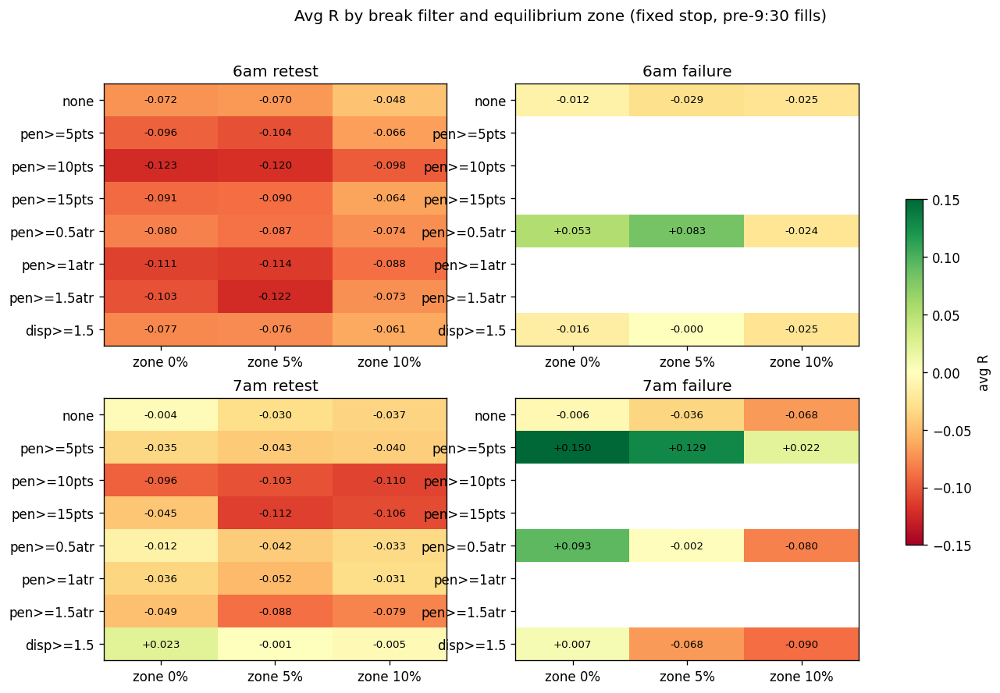

# Hourly-Range Fade: break-quality filters and equilibrium-zone targets

3588 base setups per zone variant. Penetration = deepest wick past the broken level during the break phase; ATR = 1m ATR(14) at the break bar; displacement = breaking bar body / prior 20-bar average body. Zone z pulls the target forward of the midpoint by z*range; the stop is re-sized to keep 1.3:1 to the actual target and the cancel rule applies at the zone edge. Filters skip the day (no roll to a later break). Cells with n < 50 omitted.

Setup penetration distribution: median 3.8 pts (0.74 ATR); 25th pct 1.5 pts — the user's read is correct that most breaks barely clear the level.

## Best cells (fixed stop management)

| range   | model   |   zone | filter      | mgmt   |   n |   win_rate |   avg_R |   total_R |   profit_factor |
|:--------|:--------|-------:|:------------|:-------|----:|-----------:|--------:|----------:|----------------:|
| 7am     | failure |   0    | pen>=5pts   | fixed  |  58 |      0.5   |   0.15  |       8.7 |           1.3   |
| 7am     | failure |   0.05 | pen>=5pts   | fixed  |  55 |      0.491 |   0.129 |       7.1 |           1.254 |
| 7am     | failure |   0    | pen>=0.5atr | fixed  | 141 |      0.475 |   0.093 |      13.1 |           1.177 |
| 6am     | failure |   0.05 | pen>=0.5atr | fixed  | 138 |      0.471 |   0.083 |      11.5 |           1.158 |
| 6am     | failure |   0    | pen>=0.5atr | fixed  | 142 |      0.458 |   0.053 |       7.5 |           1.097 |
| 7am     | retest  |   0    | disp>=1.5   | fixed  | 715 |      0.445 |   0.023 |      16.4 |           1.041 |
| 7am     | failure |   0.1  | pen>=5pts   | fixed  |  54 |      0.444 |   0.022 |       1.2 |           1.04  |
| 7am     | failure |   0    | disp>=1.5   | fixed  | 233 |      0.438 |   0.007 |       1.6 |           1.012 |
| 6am     | failure |   0.05 | disp>=1.5   | fixed  | 260 |      0.435 |  -0     |      -0.1 |           0.999 |
| 7am     | retest  |   0.05 | disp>=1.5   | fixed  | 700 |      0.434 |  -0.001 |      -0.8 |           0.998 |
| 7am     | failure |   0.05 | pen>=0.5atr | fixed  | 136 |      0.434 |  -0.002 |      -0.3 |           0.996 |
| 7am     | retest  |   0    | none        | fixed  | 984 |      0.433 |  -0.004 |      -4.2 |           0.992 |

## Full grid

| range   | model   |   zone | filter      | mgmt   |    n |   win_rate |   avg_R |   total_R |   profit_factor |
|:--------|:--------|-------:|:------------|:-------|-----:|-----------:|--------:|----------:|----------------:|
| 6am     | failure |   0    | none        | fixed  |  701 |      0.429 |  -0.012 |      -8.7 |           0.978 |
| 6am     | failure |   0    | pen>=0.5atr | fixed  |  142 |      0.458 |   0.053 |       7.5 |           1.097 |
| 6am     | failure |   0    | disp>=1.5   | fixed  |  264 |      0.428 |  -0.016 |      -4.1 |           0.973 |
| 6am     | failure |   0.05 | none        | fixed  |  689 |      0.422 |  -0.029 |     -19.7 |           0.951 |
| 6am     | failure |   0.05 | pen>=0.5atr | fixed  |  138 |      0.471 |   0.083 |      11.5 |           1.158 |
| 6am     | failure |   0.05 | disp>=1.5   | fixed  |  260 |      0.435 |  -0     |      -0.1 |           0.999 |
| 6am     | failure |   0.1  | none        | fixed  |  663 |      0.424 |  -0.025 |     -16.7 |           0.956 |
| 6am     | failure |   0.1  | pen>=0.5atr | fixed  |  132 |      0.424 |  -0.024 |      -3.2 |           0.958 |
| 6am     | failure |   0.1  | disp>=1.5   | fixed  |  250 |      0.424 |  -0.025 |      -6.2 |           0.957 |
| 6am     | retest  |   0    | none        | fixed  | 1276 |      0.404 |  -0.072 |     -91.5 |           0.88  |
| 6am     | retest  |   0    | pen>=5pts   | fixed  |  809 |      0.393 |  -0.096 |     -77.6 |           0.842 |
| 6am     | retest  |   0    | pen>=10pts  | fixed  |  493 |      0.381 |  -0.123 |     -60.6 |           0.801 |
| 6am     | retest  |   0    | pen>=15pts  | fixed  |  329 |      0.395 |  -0.091 |     -30   |           0.849 |
| 6am     | retest  |   0    | pen>=0.5atr | fixed  | 1090 |      0.4   |  -0.08  |     -87.2 |           0.867 |
| 6am     | retest  |   0    | pen>=1atr   | fixed  |  823 |      0.386 |  -0.111 |     -91.6 |           0.819 |
| 6am     | retest  |   0    | pen>=1.5atr | fixed  |  582 |      0.39  |  -0.103 |     -59.9 |           0.831 |
| 6am     | retest  |   0    | disp>=1.5   | fixed  |  910 |      0.401 |  -0.077 |     -70.5 |           0.871 |
| 6am     | retest  |   0.05 | none        | fixed  | 1247 |      0.404 |  -0.07  |     -87.8 |           0.882 |
| 6am     | retest  |   0.05 | pen>=5pts   | fixed  |  793 |      0.39  |  -0.104 |     -82.3 |           0.83  |
| 6am     | retest  |   0.05 | pen>=10pts  | fixed  |  481 |      0.383 |  -0.12  |     -57.8 |           0.805 |
| 6am     | retest  |   0.05 | pen>=15pts  | fixed  |  321 |      0.396 |  -0.09  |     -28.9 |           0.851 |
| 6am     | retest  |   0.05 | pen>=0.5atr | fixed  | 1066 |      0.397 |  -0.087 |     -93.1 |           0.855 |
| 6am     | retest  |   0.05 | pen>=1atr   | fixed  |  805 |      0.385 |  -0.114 |     -92   |           0.814 |
| 6am     | retest  |   0.05 | pen>=1.5atr | fixed  |  571 |      0.382 |  -0.122 |     -69.6 |           0.803 |
| 6am     | retest  |   0.05 | disp>=1.5   | fixed  |  886 |      0.402 |  -0.076 |     -67.2 |           0.873 |
| 6am     | retest  |   0.1  | none        | fixed  | 1220 |      0.414 |  -0.048 |     -58.5 |           0.918 |
| 6am     | retest  |   0.1  | pen>=5pts   | fixed  |  776 |      0.406 |  -0.066 |     -51.5 |           0.888 |
| 6am     | retest  |   0.1  | pen>=10pts  | fixed  |  469 |      0.392 |  -0.098 |     -45.8 |           0.839 |
| 6am     | retest  |   0.1  | pen>=15pts  | fixed  |  312 |      0.407 |  -0.064 |     -19.9 |           0.892 |
| 6am     | retest  |   0.1  | pen>=0.5atr | fixed  | 1043 |      0.403 |  -0.074 |     -77   |           0.876 |
| 6am     | retest  |   0.1  | pen>=1atr   | fixed  |  787 |      0.396 |  -0.088 |     -69.4 |           0.854 |
| 6am     | retest  |   0.1  | pen>=1.5atr | fixed  |  556 |      0.403 |  -0.073 |     -40.8 |           0.877 |
| 6am     | retest  |   0.1  | disp>=1.5   | fixed  |  867 |      0.408 |  -0.061 |     -52.8 |           0.897 |
| 7am     | failure |   0    | none        | fixed  |  627 |      0.432 |  -0.006 |      -3.7 |           0.99  |
| 7am     | failure |   0    | pen>=5pts   | fixed  |   58 |      0.5   |   0.15  |       8.7 |           1.3   |
| 7am     | failure |   0    | pen>=0.5atr | fixed  |  141 |      0.475 |   0.093 |      13.1 |           1.177 |
| 7am     | failure |   0    | disp>=1.5   | fixed  |  233 |      0.438 |   0.007 |       1.6 |           1.012 |
| 7am     | failure |   0.05 | none        | fixed  |  613 |      0.419 |  -0.036 |     -21.9 |           0.938 |
| 7am     | failure |   0.05 | pen>=5pts   | fixed  |   55 |      0.491 |   0.129 |       7.1 |           1.254 |
| 7am     | failure |   0.05 | pen>=0.5atr | fixed  |  136 |      0.434 |  -0.002 |      -0.3 |           0.996 |
| 7am     | failure |   0.05 | disp>=1.5   | fixed  |  227 |      0.405 |  -0.068 |     -15.4 |           0.886 |
| 7am     | failure |   0.1  | none        | fixed  |  597 |      0.405 |  -0.068 |     -40.4 |           0.886 |
| 7am     | failure |   0.1  | pen>=5pts   | fixed  |   54 |      0.444 |   0.022 |       1.2 |           1.04  |
| 7am     | failure |   0.1  | pen>=0.5atr | fixed  |  135 |      0.4   |  -0.08  |     -10.8 |           0.867 |
| 7am     | failure |   0.1  | disp>=1.5   | fixed  |  220 |      0.395 |  -0.09  |     -19.9 |           0.85  |
| 7am     | retest  |   0    | none        | fixed  |  984 |      0.433 |  -0.004 |      -4.2 |           0.992 |
| 7am     | retest  |   0    | pen>=5pts   | fixed  |  648 |      0.42  |  -0.035 |     -22.4 |           0.94  |
| 7am     | retest  |   0    | pen>=10pts  | fixed  |  374 |      0.393 |  -0.096 |     -35.9 |           0.842 |
| 7am     | retest  |   0    | pen>=15pts  | fixed  |  248 |      0.415 |  -0.045 |     -11.1 |           0.923 |
| 7am     | retest  |   0    | pen>=0.5atr | fixed  |  843 |      0.429 |  -0.012 |     -10.4 |           0.978 |
| 7am     | retest  |   0    | pen>=1atr   | fixed  |  611 |      0.419 |  -0.036 |     -22.2 |           0.937 |
| 7am     | retest  |   0    | pen>=1.5atr | fixed  |  421 |      0.413 |  -0.049 |     -20.8 |           0.916 |
| 7am     | retest  |   0    | disp>=1.5   | fixed  |  715 |      0.445 |   0.023 |      16.4 |           1.041 |
| 7am     | retest  |   0.05 | none        | fixed  |  965 |      0.422 |  -0.03  |     -28.9 |           0.948 |
| 7am     | retest  |   0.05 | pen>=5pts   | fixed  |  632 |      0.416 |  -0.043 |     -27.1 |           0.927 |
| 7am     | retest  |   0.05 | pen>=10pts  | fixed  |  364 |      0.39  |  -0.103 |     -37.4 |           0.832 |
| 7am     | retest  |   0.05 | pen>=15pts  | fixed  |  241 |      0.386 |  -0.112 |     -27.1 |           0.817 |
| 7am     | retest  |   0.05 | pen>=0.5atr | fixed  |  826 |      0.416 |  -0.042 |     -34.8 |           0.928 |
| 7am     | retest  |   0.05 | pen>=1atr   | fixed  |  599 |      0.412 |  -0.052 |     -30.9 |           0.912 |
| 7am     | retest  |   0.05 | pen>=1.5atr | fixed  |  411 |      0.397 |  -0.088 |     -36.1 |           0.854 |
| 7am     | retest  |   0.05 | disp>=1.5   | fixed  |  700 |      0.434 |  -0.001 |      -0.8 |           0.998 |
| 7am     | retest  |   0.1  | none        | fixed  |  943 |      0.419 |  -0.037 |     -34.5 |           0.937 |
| 7am     | retest  |   0.1  | pen>=5pts   | fixed  |  616 |      0.417 |  -0.04  |     -24.9 |           0.931 |
| 7am     | retest  |   0.1  | pen>=10pts  | fixed  |  354 |      0.387 |  -0.11  |     -38.9 |           0.821 |
| 7am     | retest  |   0.1  | pen>=15pts  | fixed  |  234 |      0.389 |  -0.106 |     -24.7 |           0.827 |
| 7am     | retest  |   0.1  | pen>=0.5atr | fixed  |  806 |      0.421 |  -0.033 |     -26.3 |           0.944 |
| 7am     | retest  |   0.1  | pen>=1atr   | fixed  |  584 |      0.421 |  -0.031 |     -18.2 |           0.946 |
| 7am     | retest  |   0.1  | pen>=1.5atr | fixed  |  402 |      0.4   |  -0.079 |     -31.7 |           0.868 |
| 7am     | retest  |   0.1  | disp>=1.5   | fixed  |  682 |      0.433 |  -0.005 |      -3.5 |           0.991 |

## Full grid (breakeven-at-halfway management)

| range   | model   |   zone | filter      | mgmt   |    n |   win_rate |   avg_R |   total_R |   profit_factor |
|:--------|:--------|-------:|:------------|:-------|-----:|-----------:|--------:|----------:|----------------:|
| 6am     | failure |   0    | none        | be25   |  701 |      0.429 |  -0.038 |     -26.6 |           0.906 |
| 6am     | failure |   0    | pen>=0.5atr | be25   |  142 |      0.458 |   0.023 |       3.2 |           1.059 |
| 6am     | failure |   0    | disp>=1.5   | be25   |  264 |      0.428 |  -0.025 |      -6.5 |           0.938 |
| 6am     | failure |   0.05 | none        | be25   |  689 |      0.422 |  -0.036 |     -24.9 |           0.911 |
| 6am     | failure |   0.05 | pen>=0.5atr | be25   |  138 |      0.471 |   0.038 |       5.3 |           1.11  |
| 6am     | failure |   0.05 | disp>=1.5   | be25   |  260 |      0.435 |  -0.014 |      -3.6 |           0.966 |
| 6am     | failure |   0.1  | none        | be25   |  663 |      0.424 |  -0.037 |     -24.8 |           0.91  |
| 6am     | failure |   0.1  | pen>=0.5atr | be25   |  132 |      0.424 |   0.011 |       1.4 |           1.029 |
| 6am     | failure |   0.1  | disp>=1.5   | be25   |  250 |      0.424 |  -0.026 |      -6.5 |           0.938 |
| 6am     | retest  |   0    | none        | be25   | 1276 |      0.404 |  -0.074 |     -95   |           0.823 |
| 6am     | retest  |   0    | pen>=5pts   | be25   |  809 |      0.393 |  -0.1   |     -81   |           0.762 |
| 6am     | retest  |   0    | pen>=10pts  | be25   |  493 |      0.381 |  -0.136 |     -67   |           0.681 |
| 6am     | retest  |   0    | pen>=15pts  | be25   |  329 |      0.395 |  -0.108 |     -35.6 |           0.74  |
| 6am     | retest  |   0    | pen>=0.5atr | be25   | 1090 |      0.4   |  -0.076 |     -83   |           0.82  |
| 6am     | retest  |   0    | pen>=1atr   | be25   |  823 |      0.386 |  -0.111 |     -91.7 |           0.74  |
| 6am     | retest  |   0    | pen>=1.5atr | be25   |  582 |      0.39  |  -0.11  |     -64.3 |           0.738 |
| 6am     | retest  |   0    | disp>=1.5   | be25   |  910 |      0.401 |  -0.077 |     -70.3 |           0.815 |
| 6am     | retest  |   0.05 | none        | be25   | 1247 |      0.404 |  -0.07  |     -87.1 |           0.833 |
| 6am     | retest  |   0.05 | pen>=5pts   | be25   |  793 |      0.39  |  -0.098 |     -77.9 |           0.767 |
| 6am     | retest  |   0.05 | pen>=10pts  | be25   |  481 |      0.383 |  -0.126 |     -60.7 |           0.704 |
| 6am     | retest  |   0.05 | pen>=15pts  | be25   |  321 |      0.396 |  -0.089 |     -28.7 |           0.786 |
| 6am     | retest  |   0.05 | pen>=0.5atr | be25   | 1066 |      0.397 |  -0.077 |     -82.4 |           0.816 |
| 6am     | retest  |   0.05 | pen>=1atr   | be25   |  805 |      0.385 |  -0.101 |     -81.4 |           0.763 |
| 6am     | retest  |   0.05 | pen>=1.5atr | be25   |  571 |      0.382 |  -0.114 |     -64.9 |           0.733 |
| 6am     | retest  |   0.05 | disp>=1.5   | be25   |  886 |      0.402 |  -0.075 |     -66.2 |           0.823 |
| 6am     | retest  |   0.1  | none        | be25   | 1220 |      0.414 |  -0.053 |     -64.8 |           0.87  |
| 6am     | retest  |   0.1  | pen>=5pts   | be25   |  776 |      0.406 |  -0.067 |     -51.8 |           0.837 |
| 6am     | retest  |   0.1  | pen>=10pts  | be25   |  469 |      0.392 |  -0.091 |     -42.5 |           0.779 |
| 6am     | retest  |   0.1  | pen>=15pts  | be25   |  312 |      0.407 |  -0.071 |     -22   |           0.825 |
| 6am     | retest  |   0.1  | pen>=0.5atr | be25   | 1043 |      0.403 |  -0.059 |     -61.4 |           0.857 |
| 6am     | retest  |   0.1  | pen>=1atr   | be25   |  787 |      0.396 |  -0.076 |     -59.9 |           0.818 |
| 6am     | retest  |   0.1  | pen>=1.5atr | be25   |  556 |      0.403 |  -0.07  |     -38.8 |           0.828 |
| 6am     | retest  |   0.1  | disp>=1.5   | be25   |  867 |      0.408 |  -0.053 |     -45.7 |           0.873 |
| 7am     | failure |   0    | none        | be25   |  627 |      0.432 |  -0.02  |     -12.7 |           0.951 |
| 7am     | failure |   0    | pen>=5pts   | be25   |   58 |      0.5   |   0.034 |       2   |           1.083 |
| 7am     | failure |   0    | pen>=0.5atr | be25   |  141 |      0.475 |   0.013 |       1.8 |           1.031 |
| 7am     | failure |   0    | disp>=1.5   | be25   |  233 |      0.438 |  -0.009 |      -2.1 |           0.978 |
| 7am     | failure |   0.05 | none        | be25   |  613 |      0.419 |  -0.024 |     -14.6 |           0.941 |
| 7am     | failure |   0.05 | pen>=5pts   | be25   |   55 |      0.491 |   0.067 |       3.7 |           1.176 |
| 7am     | failure |   0.05 | pen>=0.5atr | be25   |  136 |      0.434 |  -0.029 |      -4   |           0.929 |
| 7am     | failure |   0.05 | disp>=1.5   | be25   |  227 |      0.405 |  -0.015 |      -3.5 |           0.96  |
| 7am     | failure |   0.1  | none        | be25   |  597 |      0.405 |  -0.034 |     -20.4 |           0.916 |
| 7am     | failure |   0.1  | pen>=5pts   | be25   |   54 |      0.444 |   0.039 |       2.1 |           1.105 |
| 7am     | failure |   0.1  | pen>=0.5atr | be25   |  135 |      0.4   |  -0.027 |      -3.6 |           0.932 |
| 7am     | failure |   0.1  | disp>=1.5   | be25   |  220 |      0.395 |  -0.065 |     -14.3 |           0.843 |
| 7am     | retest  |   0    | none        | be25   |  984 |      0.433 |   0.018 |      18   |           1.047 |
| 7am     | retest  |   0    | pen>=5pts   | be25   |  648 |      0.42  |  -0.015 |      -9.8 |           0.963 |
| 7am     | retest  |   0    | pen>=10pts  | be25   |  374 |      0.393 |  -0.065 |     -24.3 |           0.841 |
| 7am     | retest  |   0    | pen>=15pts  | be25   |  248 |      0.415 |  -0.064 |     -15.9 |           0.846 |
| 7am     | retest  |   0    | pen>=0.5atr | be25   |  843 |      0.429 |   0.001 |       1.1 |           1.003 |
| 7am     | retest  |   0    | pen>=1atr   | be25   |  611 |      0.419 |  -0.007 |      -4.2 |           0.983 |
| 7am     | retest  |   0    | pen>=1.5atr | be25   |  421 |      0.413 |  -0.04  |     -16.8 |           0.906 |
| 7am     | retest  |   0    | disp>=1.5   | be25   |  715 |      0.445 |   0.047 |      33.9 |           1.126 |
| 7am     | retest  |   0.05 | none        | be25   |  965 |      0.422 |   0.013 |      12.1 |           1.032 |
| 7am     | retest  |   0.05 | pen>=5pts   | be25   |  632 |      0.416 |  -0.019 |     -11.9 |           0.953 |
| 7am     | retest  |   0.05 | pen>=10pts  | be25   |  364 |      0.39  |  -0.072 |     -26.2 |           0.826 |
| 7am     | retest  |   0.05 | pen>=15pts  | be25   |  241 |      0.386 |  -0.095 |     -23   |           0.772 |
| 7am     | retest  |   0.05 | pen>=0.5atr | be25   |  826 |      0.416 |   0.002 |       1.4 |           1.004 |
| 7am     | retest  |   0.05 | pen>=1atr   | be25   |  599 |      0.412 |  -0.013 |      -8   |           0.967 |
| 7am     | retest  |   0.05 | pen>=1.5atr | be25   |  411 |      0.397 |  -0.055 |     -22.6 |           0.872 |
| 7am     | retest  |   0.05 | disp>=1.5   | be25   |  700 |      0.434 |   0.037 |      26   |           1.1   |
| 7am     | retest  |   0.1  | none        | be25   |  943 |      0.419 |   0.01  |       9.2 |           1.026 |
| 7am     | retest  |   0.1  | pen>=5pts   | be25   |  616 |      0.417 |  -0.019 |     -11.7 |           0.953 |
| 7am     | retest  |   0.1  | pen>=10pts  | be25   |  354 |      0.387 |  -0.079 |     -27.8 |           0.815 |
| 7am     | retest  |   0.1  | pen>=15pts  | be25   |  234 |      0.389 |  -0.091 |     -21.3 |           0.783 |
| 7am     | retest  |   0.1  | pen>=0.5atr | be25   |  806 |      0.421 |   0.025 |      19.8 |           1.066 |
| 7am     | retest  |   0.1  | pen>=1atr   | be25   |  584 |      0.421 |   0.007 |       4.3 |           1.019 |
| 7am     | retest  |   0.1  | pen>=1.5atr | be25   |  402 |      0.4   |  -0.052 |     -20.8 |           0.877 |
| 7am     | retest  |   0.1  | disp>=1.5   | be25   |  682 |      0.433 |   0.034 |      23.5 |           1.092 |
