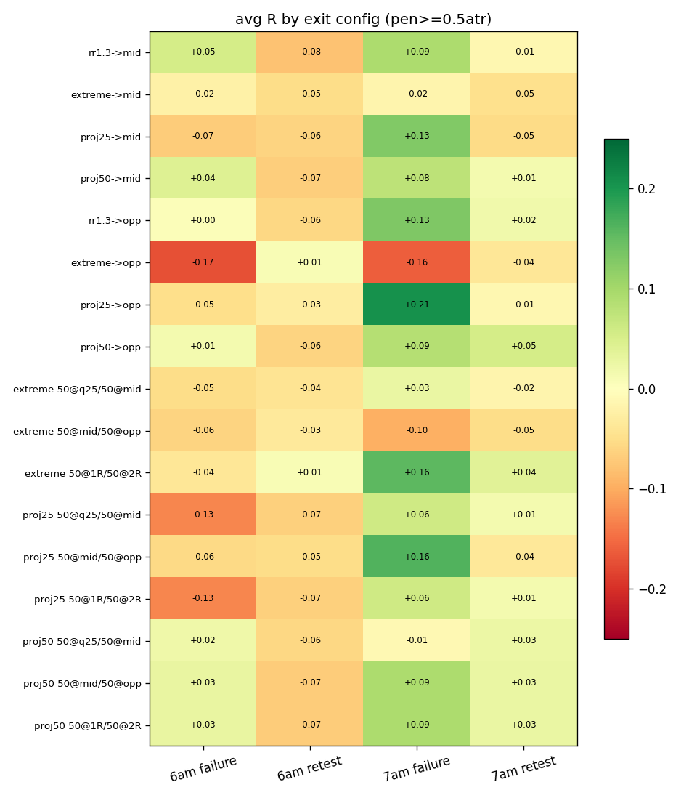
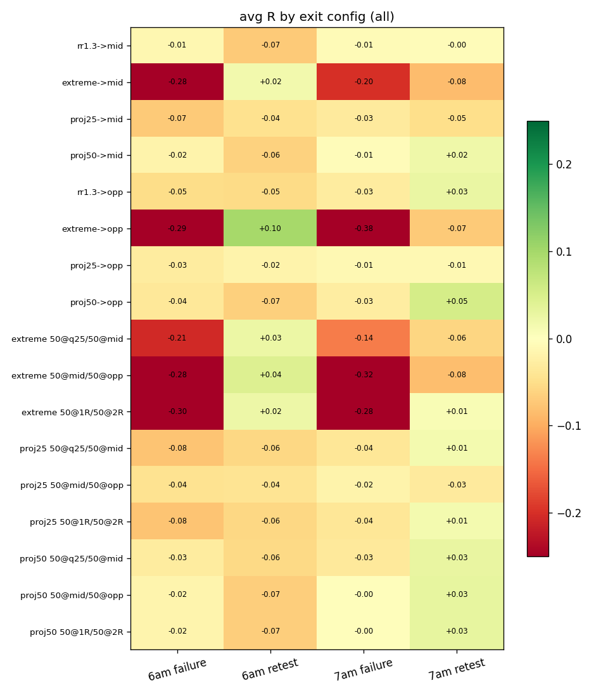

# Hourly-Range Fade: stop / target / partial variants

3588 setups (zone=0 detection, pre-9:30 fills, midpoint cancel rule). R normalized by initial stop distance; same-bar stop+target = stop; breakeven moves apply from the bar after the first partial fills; remaining size exits on the 16:00 close. Cells with n < 40 omitted.

## Top configs, penetration >= 0.5 ATR population

| range   | model   | config               |   n |   win_rate |   avg_R |   median_R |   total_R |   profit_factor |
|:--------|:--------|:---------------------|----:|-----------:|--------:|-----------:|----------:|----------------:|
| 7am     | failure | proj25->opp          | 141 |      0.241 |   0.206 |       -1   |    29     |           1.271 |
| 7am     | failure | proj25 50@mid/50@opp | 141 |      0.376 |   0.163 |       -1   |    23     |           1.261 |
| 7am     | failure | extreme 50@1R/50@2R  | 141 |      0.582 |   0.156 |        0.5 |    22     |           1.373 |
| 7am     | failure | rr1.3->opp           | 141 |      0.489 |   0.129 |       -1   |    18.189 |           1.254 |
| 7am     | failure | proj25->mid          | 141 |      0.376 |   0.128 |       -1   |    18     |           1.205 |
| 7am     | failure | rr1.3->mid           | 141 |      0.475 |   0.093 |       -1   |    13.1   |           1.177 |
| 7am     | failure | proj50 50@1R/50@2R   | 141 |      0.539 |   0.092 |        0.5 |    13     |           1.2   |
| 7am     | failure | proj50 50@mid/50@opp | 141 |      0.539 |   0.092 |        0.5 |    13     |           1.2   |

## All setups (no break filter)

| range   | model   | config                |    n |   win_rate |   avg_R |   median_R |   total_R |   profit_factor |
|:--------|:--------|:----------------------|-----:|-----------:|--------:|-----------:|----------:|----------------:|
| 6am     | retest  | extreme->opp          | 1276 |      0.209 |   0.099 |      -1    |   126.047 |           1.125 |
| 7am     | retest  | proj50->opp           |  984 |      0.353 |   0.053 |      -1    |    51.947 |           1.082 |
| 6am     | retest  | extreme 50@mid/50@opp | 1276 |      0.312 |   0.044 |      -1    |    56.29  |           1.064 |
| 7am     | retest  | proj50 50@mid/50@opp  |  984 |      0.51  |   0.03  |       0.5  |    29.955 |           1.062 |
| 7am     | retest  | proj50 50@1R/50@2R    |  984 |      0.51  |   0.03  |       0.5  |    29.955 |           1.062 |
| 7am     | retest  | proj50 50@q25/50@mid  |  984 |      0.68  |   0.028 |       0.25 |    27.75  |           1.088 |
| 7am     | retest  | rr1.3->opp            |  984 |      0.447 |   0.026 |      -1    |    25.204 |           1.046 |
| 6am     | retest  | extreme 50@q25/50@mid | 1276 |      0.462 |   0.025 |      -1    |    32.254 |           1.047 |
| 6am     | retest  | extreme 50@1R/50@2R   | 1276 |      0.515 |   0.022 |       0.5  |    28.5   |           1.046 |
| 7am     | retest  | proj50->mid           |  984 |      0.51  |   0.02  |       1    |    20     |           1.041 |
| 6am     | retest  | extreme->mid          | 1276 |      0.312 |   0.016 |      -1    |    19.824 |           1.023 |
| 7am     | retest  | proj25 50@1R/50@2R    |  984 |      0.506 |   0.015 |       0.5  |    15     |           1.031 |
| 7am     | retest  | proj25 50@q25/50@mid  |  984 |      0.506 |   0.015 |       0.5  |    15     |           1.031 |
| 7am     | retest  | extreme 50@1R/50@2R   |  984 |      0.506 |   0.009 |       0.5  |     8.953 |           1.018 |
| 7am     | failure | proj50 50@mid/50@opp  |  627 |      0.498 |  -0.003 |      -1    |    -2     |           0.994 |

Full tables: summary_all.csv, summary_pen_ge_0.5atr.csv; yearly stability of the top cells in top_by_year.csv.