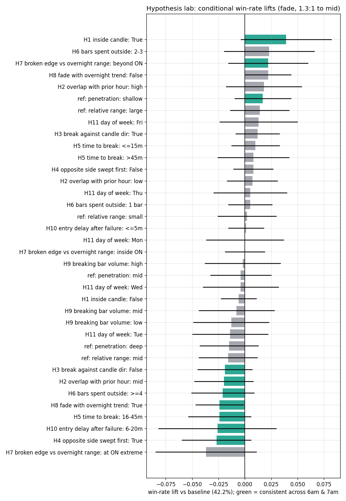

# Hypothesis Lab: what kind of 6am/7am range produces winning fades?

3588 base fade trades (failure + retest, both slots, pre-9:30 fills, 1.3:1 to mid). Baseline win rate 42.2% (breakeven at 1.3:1 = 43.5%). 'consistent' requires the lift to have the same sign in the 6am and 7am populations independently.

## All hypothesis buckets

| hypothesis                        | bucket        |    n |   win_rate |   lift |   ci95 |   avg_R |   win_6am |   win_7am | consistent   |
|:----------------------------------|:--------------|-----:|-----------:|-------:|-------:|--------:|----------:|----------:|:-------------|
| H1 inside candle                  | False         | 3080 |      0.415 | -0.006 |  0.017 |  -0.045 |     0.408 |     0.424 | False        |
| H1 inside candle                  | True          |  508 |      0.461 |  0.039 |  0.043 |   0.059 |     0.439 |     0.493 | True         |
| H2 overlap with prior hour        | low           | 1639 |      0.428 |  0.007 |  0.024 |  -0.015 |     0.422 |     0.435 | False        |
| H2 overlap with prior hour        | mid           | 1215 |      0.402 | -0.02  |  0.028 |  -0.076 |     0.397 |     0.408 | True         |
| H2 overlap with prior hour        | high          |  734 |      0.44  |  0.018 |  0.036 |   0.012 |     0.421 |     0.467 | False        |
| H3 break against candle dir       | False         | 1407 |      0.403 | -0.019 |  0.026 |  -0.073 |     0.412 |     0.391 | True         |
| H3 break against candle dir       | True          | 2181 |      0.434 |  0.012 |  0.021 |  -0.002 |     0.413 |     0.457 | False        |
| H4 opposite side swept first      | False         | 2737 |      0.43  |  0.008 |  0.019 |  -0.011 |     0.424 |     0.437 | False        |
| H4 opposite side swept first      | True          |  851 |      0.395 | -0.027 |  0.033 |  -0.092 |     0.383 |     0.416 | True         |
| H5 time to break                  | <=15m         | 1737 |      0.432 |  0.01  |  0.023 |  -0.007 |     0.405 |     0.463 | False        |
| H5 time to break                  | 16-45m        | 1016 |      0.398 | -0.024 |  0.03  |  -0.085 |     0.413 |     0.387 | True         |
| H5 time to break                  | >45m          |  835 |      0.43  |  0.008 |  0.034 |  -0.011 |     0.424 |     0.448 | False        |
| H6 bars spent outside             | 1 bar         | 2042 |      0.427 |  0.005 |  0.021 |  -0.019 |     0.42  |     0.435 | False        |
| H6 bars spent outside             | 2-3           |  519 |      0.445 |  0.023 |  0.043 |   0.024 |     0.42  |     0.473 | False        |
| H6 bars spent outside             | >=4           | 1027 |      0.4   | -0.021 |  0.03  |  -0.08  |     0.396 |     0.406 | True         |
| H7 broken edge vs overnight range | inside ON     | 2546 |      0.422 |  0     |  0.019 |  -0.03  |     0.418 |     0.427 | False        |
| H7 broken edge vs overnight range | at ON extreme |  393 |      0.384 | -0.037 |  0.048 |  -0.116 |     0.339 |     0.45  | False        |
| H7 broken edge vs overnight range | beyond ON     |  649 |      0.444 |  0.022 |  0.038 |   0.021 |     0.448 |     0.441 | True         |
| H8 fade with overnight trend      | False         | 1885 |      0.444 |  0.022 |  0.022 |   0.02  |     0.415 |     0.475 | False        |
| H8 fade with overnight trend      | True          | 1703 |      0.398 | -0.024 |  0.023 |  -0.086 |     0.411 |     0.379 | True         |
| H9 breaking bar volume            | low           |  727 |      0.409 | -0.013 |  0.036 |  -0.06  |     0.423 |     0.39  | False        |
| H9 breaking bar volume            | mid           |  727 |      0.414 | -0.008 |  0.036 |  -0.048 |     0.402 |     0.428 | False        |
| H9 breaking bar volume            | high          |  727 |      0.42  | -0.002 |  0.036 |  -0.035 |     0.418 |     0.422 | False        |
| H10 entry delay after failure     | <=5m          | 3261 |      0.423 |  0.001 |  0.017 |  -0.027 |     0.412 |     0.436 | False        |
| H10 entry delay after failure     | 6-20m         |  293 |      0.396 | -0.026 |  0.056 |  -0.089 |     0.388 |     0.407 | True         |
| H11 day of week                   | Fri           |  699 |      0.435 |  0.013 |  0.037 |   0     |     0.402 |     0.475 | False        |
| H11 day of week                   | Mon           |  681 |      0.421 | -0     |  0.037 |  -0.031 |     0.432 |     0.41  | False        |
| H11 day of week                   | Thu           |  754 |      0.427 |  0.005 |  0.035 |  -0.018 |     0.45  |     0.399 | False        |
| H11 day of week                   | Tue           |  721 |      0.408 | -0.014 |  0.036 |  -0.062 |     0.376 |     0.45  | False        |
| H11 day of week                   | Wed           |  733 |      0.417 | -0.004 |  0.036 |  -0.04  |     0.406 |     0.432 | False        |
| ref: penetration                  | shallow       | 1290 |      0.439 |  0.017 |  0.027 |   0.009 |     0.439 |     0.439 | True         |
| ref: penetration                  | mid           | 1122 |      0.418 | -0.004 |  0.029 |  -0.039 |     0.404 |     0.434 | False        |
| ref: penetration                  | deep          | 1176 |      0.406 | -0.015 |  0.028 |  -0.065 |     0.392 |     0.425 | False        |
| ref: relative range               | small         | 1187 |      0.424 |  0.002 |  0.028 |  -0.025 |     0.423 |     0.425 | False        |
| ref: relative range               | mid           | 1186 |      0.406 | -0.016 |  0.028 |  -0.067 |     0.392 |     0.422 | False        |
| ref: relative range               | large         | 1187 |      0.436 |  0.014 |  0.028 |   0.002 |     0.421 |     0.453 | False        |

## Interaction: H4 x penetration

|                    |   n |   win |   avg_R |
|:-------------------|----:|------:|--------:|
| (False, 'shallow') | 994 | 0.441 |   0.013 |
| (False, 'mid')     | 866 | 0.421 |  -0.031 |
| (False, 'deep')    | 877 | 0.426 |  -0.019 |
| (True, 'shallow')  | 296 | 0.432 |  -0.005 |
| (True, 'mid')      | 256 | 0.406 |  -0.066 |
| (True, 'deep')     | 299 | 0.348 |  -0.2   |

## Interaction: H3 x rel_range

|                  |   n |   win |   avg_R |
|:-----------------|----:|------:|--------:|
| (False, 'small') | 528 | 0.386 |  -0.111 |
| (False, 'mid')   | 477 | 0.403 |  -0.074 |
| (False, 'large') | 391 | 0.419 |  -0.035 |
| (True, 'small')  | 659 | 0.454 |   0.044 |
| (True, 'mid')    | 709 | 0.408 |  -0.062 |
| (True, 'large')  | 796 | 0.443 |   0.02  |

## Interaction: H5 x model

|                       |    n |   win |   avg_R |
|:----------------------|-----:|------:|--------:|
| ('<=15m', 'failure')  |  687 | 0.426 |  -0.019 |
| ('<=15m', 'retest')   | 1050 | 0.435 |   0.001 |
| ('16-45m', 'failure') |  343 | 0.402 |  -0.075 |
| ('16-45m', 'retest')  |  673 | 0.395 |  -0.091 |
| ('>45m', 'failure')   |  298 | 0.473 |   0.088 |
| ('>45m', 'retest')    |  537 | 0.406 |  -0.066 |

## Interaction: H7 x H4

|                          |    n |   win |   avg_R |
|:-------------------------|-----:|------:|--------:|
| ('inside ON', False)     | 1905 | 0.433 |  -0.004 |
| ('inside ON', True)      |  641 | 0.388 |  -0.107 |
| ('at ON extreme', False) |  292 | 0.384 |  -0.118 |
| ('at ON extreme', True)  |  101 | 0.386 |  -0.112 |
| ('beyond ON', False)     |  540 | 0.444 |   0.022 |
| ('beyond ON', True)      |  109 | 0.44  |   0.013 |

## Interaction: H9 x model

|                     |   n |   win |   avg_R |
|:--------------------|----:|------:|--------:|
| ('low', 'failure')  | 248 | 0.379 |  -0.128 |
| ('low', 'retest')   | 479 | 0.424 |  -0.025 |
| ('mid', 'failure')  | 288 | 0.448 |   0.03  |
| ('mid', 'retest')   | 439 | 0.392 |  -0.099 |
| ('high', 'failure') | 228 | 0.465 |   0.069 |
| ('high', 'retest')  | 499 | 0.399 |  -0.083 |

## Composite sequence rules (out-of-the-box findings)

| rule | n | win | avg R | PF | 6am | 7am |
|---|---|---|---|---|---|---|
| baseline (all trades) | 3588 | 42.2% | -0.027 | 0.95 | 41.2% | 43.6% |
| H1: inside candle | 508 | 46.1% | +0.059 | 1.11 | 43.9% | 49.3% |
| inside + no prior opposite sweep | 340 | 48.8% | +0.123 | 1.24 | 46.9% | 51.4% |
| inside + failure model | 187 | 49.2% | +0.132 | 1.26 | 48.6% | 50.0% |
| avoid all consistent negatives* | 812 | 46.7% | +0.074 | 1.14 | 44.1% | 49.1% |
| avoid negatives + inside candle | 73 | 56.2% | +0.292 | 1.67 | 56.8% | 55.6% |

*avoid = no prior opposite-side sweep, fewer than 4 bars spent outside, break in
the candle's close direction, and not fading with the overnight drift.

Yearly stability: 'avoid consistent negatives' is positive 5 of 6 years (only
2021 at -0.04R) and improving (2025 +0.16R, 2026 +0.28R). 'inside + no opp
sweep' is positive 5 of 6 with 2025 the exception. The n=73 stack is reported
as a curiosity, not a conclusion.

## Unified theme

The profitable fade is against a FAILED CONTINUATION attempt: the market tries
to extend in the direction it was already going (the candle's own direction,
the overnight drift), fails to hold outside, and snaps back. Failed
counter-trend pokes, second-side breaks after the opposite side was already
swept, and grinding multi-bar acceptance outside the range are the fades that
lose. Volume at the break carries no information. Day of week carries none.
