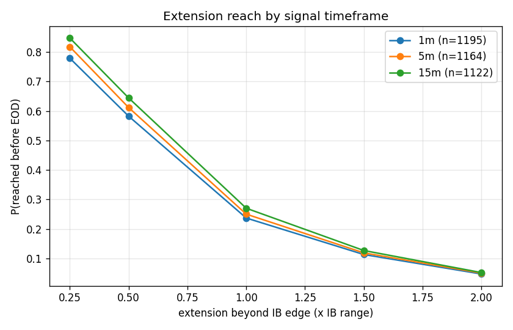
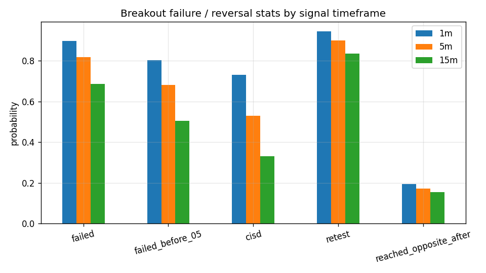

# IB Breakouts: 1m vs 5m vs 15m signal timeframe

Same IB (9:30-10:30 ET high/low), same data; only the *signal* timeframe changes. A breakout is the first close of that timeframe beyond the edge, and displacement / FVG / CISD / failure are all defined on bars of that timeframe. Outcomes (extensions, opposite-side touches) use that timeframe's highs/lows.

## Baseline outcomes of the first breakout

|                        |       1m |       5m |      15m |
|:-----------------------|---------:|---------:|---------:|
| n_first_breakouts      | 1195     | 1164     | 1122     |
| ext_0.25               |    0.779 |    0.818 |    0.848 |
| ext_0.5                |    0.582 |    0.612 |    0.644 |
| ext_1.0                |    0.237 |    0.25  |    0.27  |
| ext_1.5                |    0.113 |    0.119 |    0.127 |
| ext_2.0                |    0.047 |    0.05  |    0.052 |
| failed                 |    0.896 |    0.816 |    0.686 |
| failed_before_05       |    0.803 |    0.68  |    0.504 |
| cisd                   |    0.731 |    0.53  |    0.332 |
| retest                 |    0.944 |    0.9   |    0.835 |
| resumed_after_retest   |    0.808 |    0.719 |    0.615 |
| reached_opposite_after |    0.194 |    0.173 |    0.154 |
| eod_beyond_edge        |    0.564 |    0.59  |    0.612 |

## Breakout character

|                                        |     1m |     5m |     15m |
|:---------------------------------------|-------:|-------:|--------:|
| median breakout time (min after 10:30) | 20     | 25     |  30     |
| median close-through depth (R)         |  0.033 |  0.065 |   0.108 |
| median MFE after breakout (R)          |  0.585 |  0.613 |   0.649 |
| P(FVG at breakout)                     |  0.785 |  0.771 |   0.761 |
| median CISD delay (min)                | 20     | 50     | 105     |

## Day taxonomy (close-based, so it shifts with timeframe)

| pattern         |    1m |    5m |   15m |
|:----------------|------:|------:|------:|
| both_down_first | 0.093 | 0.071 | 0.05  |
| both_up_first   | 0.08  | 0.066 | 0.056 |
| down_only       | 0.367 | 0.37  | 0.363 |
| none            | 0.041 | 0.067 | 0.101 |
| up_only         | 0.419 | 0.426 | 0.431 |

## CISD

|                          |     1m |     5m |     15m |
|:-------------------------|-------:|-------:|--------:|
| P(CISD | breakout)       |  0.731 |  0.53  |   0.332 |
| P(reach IB mid | CISD)   |  0.611 |  0.703 |   0.78  |
| P(reach opposite | CISD) |  0.266 |  0.326 |   0.452 |
| median CISD delay (min)  | 20     | 50     | 105     |

## FVG

|                              |    1m |    5m |   15m |
|:-----------------------------|------:|------:|------:|
| P(FVG forms)                 | 0.785 | 0.771 | 0.761 |
| P(revisited | FVG)           | 0.937 | 0.882 | 0.819 |
| P(holds -> 0.5R | revisited) | 0.14  | 0.249 | 0.376 |
| P(reach 1R | FVG)            | 0.243 | 0.278 | 0.311 |
| P(reach 1R | no FVG)         | 0.214 | 0.157 | 0.138 |

## Displacement effect (weakest vs strongest quartile)

|                                         |    1m |    5m |   15m |
|:----------------------------------------|------:|------:|------:|
| ext_1.0 | disp Q1_weak                  | 0.182 | 0.18  | 0.197 |
| failed_before_05 | disp Q1_weak         | 0.863 | 0.801 | 0.667 |
| cisd | disp Q1_weak                     | 0.762 | 0.588 | 0.32  |
| reached_opposite_after | disp Q1_weak   | 0.225 | 0.219 | 0.147 |
| ext_1.0 | disp Q4_strong                | 0.27  | 0.341 | 0.402 |
| failed_before_05 | disp Q4_strong       | 0.695 | 0.486 | 0.27  |
| cisd | disp Q4_strong                   | 0.667 | 0.396 | 0.313 |
| reached_opposite_after | disp Q4_strong | 0.149 | 0.137 | 0.166 |

## Strategy expectancies

|    | tf   | strategy                                 |    n |   win_rate |   avg_R |   median_R |   total_R |   profit_factor |
|---:|:-----|:-----------------------------------------|-----:|-----------:|--------:|-----------:|----------:|----------------:|
|  0 | 1m   | S1 breakout close (stop mid, tgt 1R ext) | 1195 |      0.455 |   0.03  |     -0.239 |    36.089 |           1.064 |
|  1 | 1m   | S1 + displacement Q4                     |  282 |      0.486 |   0.063 |     -0.05  |    17.864 |           1.148 |
|  2 | 1m   | S1 + FVG present                         |  938 |      0.489 |   0.089 |     -0.051 |    83.523 |           1.199 |
|  3 | 1m   | S1 + FVG + disp Q3/Q4                    |  521 |      0.488 |   0.08  |     -0.05  |    41.864 |           1.183 |
|  4 | 1m   | S1 early (10:30-12:00)                   |  997 |      0.449 |   0.034 |     -0.414 |    33.748 |           1.068 |
|  5 | 1m   | S1 + narrow IB (bottom 40%)              |  454 |      0.434 |   0.048 |     -0.934 |    21.853 |           1.092 |
|  6 | 1m   | S1 + wide IB (top 40%)                   |  494 |      0.488 |   0.044 |     -0.042 |    21.494 |           1.106 |
|  7 | 1m   | S2 retest limit at edge (tgt 0.5R ext)   | 1128 |      0.519 |   0.037 |      0.159 |    41.508 |           1.086 |
|  8 | 1m   | S2 retest limit at edge (tgt 1R ext)     | 1128 |      0.428 |   0.019 |     -0.459 |    21.888 |           1.039 |
|  9 | 1m   | S2 (0.5R) + FVG present                  |  873 |      0.542 |   0.072 |      0.259 |    62.56  |           1.176 |
| 10 | 1m   | S2 (0.5R) + displacement Q3/Q4           |  535 |      0.523 |   0.044 |      0.19  |    23.566 |           1.105 |
| 11 | 1m   | S3 CISD fade to opposite edge            |  869 |      0.362 |  -0.018 |     -1     |   -15.501 |           0.969 |
| 12 | 1m   | S3 + weak breakout (disp Q1/Q2)          |  464 |      0.366 |   0.04  |     -1     |    18.758 |           1.069 |
| 13 | 1m   | S3 + early CISD (<60m after breakout)    |  657 |      0.326 |  -0.005 |     -1     |    -3.59  |           0.992 |
| 14 | 5m   | S1 breakout close (stop mid, tgt 1R ext) | 1162 |      0.491 |   0.039 |     -0.064 |    44.892 |           1.089 |
| 15 | 5m   | S1 + displacement Q4                     |  254 |      0.528 |   0.095 |      0.097 |    24.104 |           1.258 |
| 16 | 5m   | S1 + FVG present                         |  896 |      0.533 |   0.122 |      0.104 |   109.108 |           1.309 |
| 17 | 5m   | S1 + FVG + disp Q3/Q4                    |  480 |      0.533 |   0.103 |      0.104 |    49.426 |           1.268 |
| 18 | 5m   | S1 early (10:30-12:00)                   |  941 |      0.485 |   0.046 |     -0.096 |    43.439 |           1.101 |
| 19 | 5m   | S1 + narrow IB (bottom 40%)              |  448 |      0.482 |   0.063 |     -0.104 |    28.066 |           1.133 |
| 20 | 5m   | S1 + wide IB (top 40%)                   |  488 |      0.512 |   0.046 |      0.031 |    22.509 |           1.121 |
| 21 | 5m   | S2 retest limit at edge (tgt 0.5R ext)   | 1048 |      0.535 |   0.063 |      0.232 |    66.271 |           1.154 |
| 22 | 5m   | S2 retest limit at edge (tgt 1R ext)     | 1048 |      0.449 |   0.049 |     -0.295 |    51.239 |           1.102 |
| 23 | 5m   | S2 (0.5R) + FVG present                  |  782 |      0.568 |   0.119 |      0.442 |    93.036 |           1.313 |
| 24 | 5m   | S2 (0.5R) + displacement Q3/Q4           |  469 |      0.539 |   0.074 |      0.237 |    34.764 |           1.187 |
| 25 | 5m   | S3 CISD fade to opposite edge            |  599 |      0.482 |  -0.026 |     -0.052 |   -15.28  |           0.936 |
| 26 | 5m   | S3 + weak breakout (disp Q1/Q2)          |  347 |      0.476 |  -0.033 |     -0.106 |   -11.481 |           0.923 |
| 27 | 5m   | S3 + early CISD (<60m after breakout)    |  331 |      0.429 |  -0.037 |     -0.552 |   -12.333 |           0.928 |
| 28 | 15m  | S1 breakout close (stop mid, tgt 1R ext) | 1107 |      0.509 |   0.05  |      0.028 |    54.967 |           1.127 |
| 29 | 15m  | S1 + displacement Q4                     |  248 |      0.524 |   0.015 |      0.08  |     3.684 |           1.04  |
| 30 | 15m  | S1 + FVG present                         |  849 |      0.576 |   0.183 |      0.231 |   155.615 |           1.571 |
| 31 | 15m  | S1 + FVG + disp Q3/Q4                    |  446 |      0.549 |   0.095 |      0.147 |    42.582 |           1.285 |
| 32 | 15m  | S1 early (10:30-12:00)                   |  877 |      0.502 |   0.049 |      0.008 |    42.689 |           1.117 |
| 33 | 15m  | S1 + narrow IB (bottom 40%)              |  431 |      0.501 |   0.085 |      0.018 |    36.431 |           1.199 |
| 34 | 15m  | S1 + wide IB (top 40%)                   |  454 |      0.511 |   0.032 |      0.021 |    14.656 |           1.093 |
| 35 | 15m  | S2 retest limit at edge (tgt 0.5R ext)   |  937 |      0.554 |   0.101 |      0.334 |    94.847 |           1.262 |
| 36 | 15m  | S2 retest limit at edge (tgt 1R ext)     |  937 |      0.469 |   0.093 |     -0.131 |    87.023 |           1.204 |
| 37 | 15m  | S2 (0.5R) + FVG present                  |  683 |      0.616 |   0.226 |      1     |   154.651 |           1.702 |
| 38 | 15m  | S2 (0.5R) + displacement Q3/Q4           |  418 |      0.555 |   0.096 |      0.261 |    39.964 |           1.244 |
| 39 | 15m  | S3 CISD fade to opposite edge            |  340 |      0.506 |  -0.009 |      0.003 |    -3.098 |           0.967 |
| 40 | 15m  | S3 + weak breakout (disp Q1/Q2)          |  171 |      0.48  |   0.043 |     -0.02  |     7.387 |           1.146 |
| 41 | 15m  | S3 + early CISD (<60m after breakout)    |  121 |      0.479 |   0.021 |     -0.191 |     2.484 |           1.048 |

*Note: higher-timeframe entries trigger later and deeper beyond the edge, so R-multiples are not directly comparable across rows — risk per trade (entry minus IB mid) grows with the timeframe.*