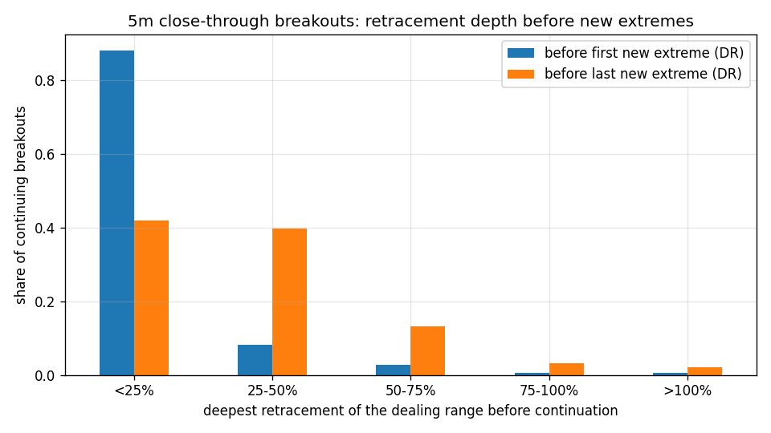
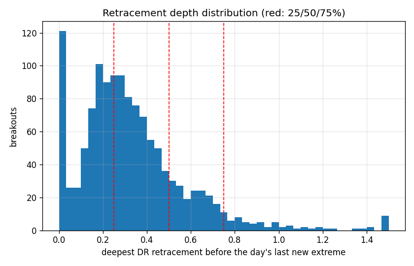

# 5m Close-Through Breakouts: retracement entries on the dealing range

Setups: 1351 first close-through IB breakouts (per side per session); 1276 (94%) printed a new extreme after the breakout bar (the continuation population the depth tables condition on).

**Dealing range (DR):** session extreme-so-far at the breakout (low for up-breakouts) to the running post-breakout extreme; depth 0% = at the extreme, 100% = full negation. The *leg* anchor instead uses the low of the consecutive-close impulse run into the breakout. Depth is measured against the extreme standing at the time of each bar, so the levels trail as the move extends.

## A. Deepest retracement before price resumed

|         |   before first new extreme (DR) |   before last new extreme (DR) |   before first new extreme (leg) |   before last new extreme (leg) |
|:--------|--------------------------------:|-------------------------------:|---------------------------------:|--------------------------------:|
| <25%    |                           0.88  |                          0.42  |                            0.798 |                           0.155 |
| 25-50%  |                           0.083 |                          0.397 |                            0.063 |                           0.255 |
| 50-75%  |                           0.027 |                          0.132 |                            0.048 |                           0.218 |
| 75-100% |                           0.005 |                          0.031 |                            0.034 |                           0.136 |
| >100%   |                           0.005 |                          0.02  |                            0.057 |                           0.236 |

Medians / 75th percentiles:

|                                |   median |   p75 |
|:-------------------------------|---------:|------:|
| before first new extreme (DR)  |    0     | 0     |
| before last new extreme (DR)   |    0.284 | 0.432 |
| before first new extreme (leg) |    0     | 0     |
| before last new extreme (leg)  |    0.6   | 0.964 |

## B. Resting limit at the 25/50/75% DR level

Limit trails the current DR; stop at the 100% level (DR low), target = the extreme standing at fill time, EOD exit at the close, same-bar stop+target counted as stop.

| level   |   P(fill) |   n_filled |   P(back to extreme | fill) |   P(stop 100% | fill) |   avg_R |   win_rate |   profit_factor |   reward_risk_at_fill |
|:--------|----------:|-----------:|----------------------------:|----------------------:|--------:|-----------:|----------------:|----------------------:|
| 25%     |     0.88  |       1189 |                       0.605 |                 0.123 |   0.019 |      0.668 |           1.098 |                 0.333 |
| 50%     |     0.55  |        743 |                       0.281 |                 0.266 |   0.025 |      0.52  |           1.074 |                 1     |
| 75%     |     0.291 |        393 |                       0.099 |                 0.547 |  -0.057 |      0.346 |           0.902 |                 3     |

## Conditioned (50% level)

### by direction

| direction   |   n |   P(fill 50%) |   P(win | fill 50%) |   avg_R (50%) |
|:------------|----:|--------------:|--------------------:|--------------:|
| down        | 640 |         0.612 |               0.26  |         0.001 |
| up          | 711 |         0.494 |               0.305 |         0.051 |

### by time_b

| time_b      |   n |   P(fill 50%) |   P(win | fill 50%) |   avg_R (50%) |
|:------------|----:|--------------:|--------------------:|--------------:|
| 10:30-11:00 | 679 |         0.642 |               0.335 |         0.078 |
| 11:00-12:00 | 290 |         0.583 |               0.249 |        -0.001 |
| after 12:00 | 382 |         0.361 |               0.152 |        -0.111 |
