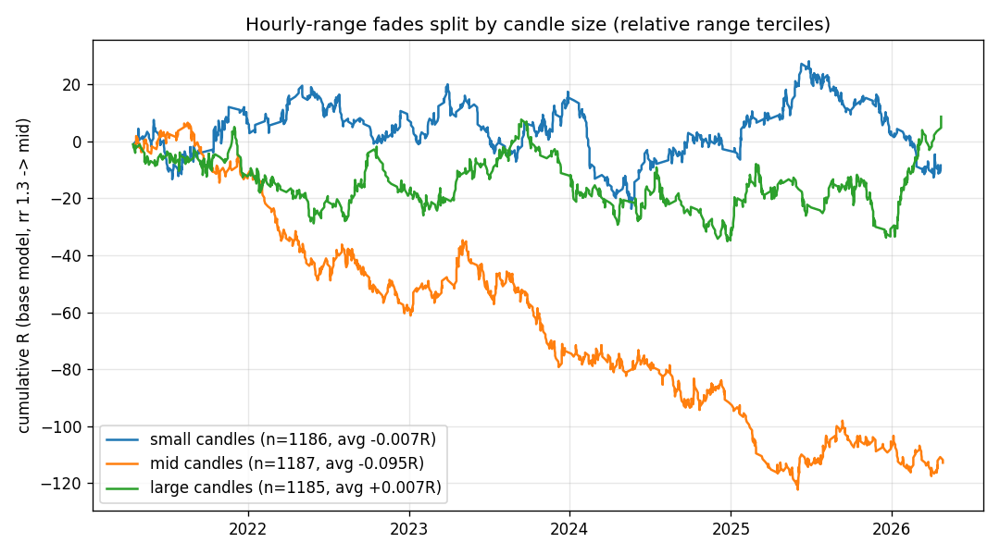

# 'Small Candles Revert' as a Trade Filter

Relative range = candle range / trailing 20-day median of the same hour slot (computable in real time at candle close). Terciles per slot. Trades are the actual fade entries from the hourly-range studies (pre-9:30 fills, midpoint cancel rule).

## Base model (rr 1.3 -> mid) by candle size, pooled

| size   |    n |   win_rate |   avg_R |   total_R |   profit_factor |
|:-------|-----:|-----------:|--------:|----------:|----------------:|
| small  | 1186 |      0.432 |  -0.007 |      -8.4 |           0.988 |
| mid    | 1187 |      0.393 |  -0.095 |    -112.9 |           0.843 |
| large  | 1185 |      0.438 |   0.007 |       8.7 |           1.013 |

## By range and model

| range   | model   | size   |   n |   win_rate |   avg_R |   total_R |   profit_factor |
|:--------|:--------|:-------|----:|-----------:|--------:|----------:|----------------:|
| 6am     | failure | small  | 250 |      0.452 |   0.04  |       9.9 |           1.072 |
| 6am     | failure | mid    | 219 |      0.37  |  -0.149 |     -32.7 |           0.763 |
| 6am     | failure | large  | 227 |      0.458 |   0.054 |      12.2 |           1.099 |
| 6am     | retest  | small  | 404 |      0.421 |  -0.032 |     -13   |           0.944 |
| 6am     | retest  | mid    | 436 |      0.401 |  -0.077 |     -33.5 |           0.872 |
| 6am     | retest  | large  | 426 |      0.387 |  -0.109 |     -46.5 |           0.822 |
| 7am     | failure | small  | 220 |      0.414 |  -0.049 |     -10.7 |           0.917 |
| 7am     | failure | mid    | 204 |      0.392 |  -0.098 |     -20   |           0.839 |
| 7am     | failure | large  | 197 |      0.497 |   0.144 |      28.4 |           1.287 |
| 7am     | retest  | small  | 312 |      0.442 |   0.017 |       5.4 |           1.031 |
| 7am     | retest  | mid    | 328 |      0.399 |  -0.081 |     -26.7 |           0.864 |
| 7am     | retest  | large  | 335 |      0.454 |   0.044 |      14.6 |           1.08  |

## Candle size x penetration filter

| size   | pen_filter    |    n |   win_rate |   avg_R |   total_R |   profit_factor |
|:-------|:--------------|-----:|-----------:|--------:|----------:|----------------:|
| small  | no pen filter | 1186 |      0.432 |  -0.007 |      -8.4 |           0.988 |
| small  | pen>=0.5atr   |  716 |      0.427 |  -0.017 |     -12.2 |           0.97  |
| mid    | no pen filter | 1187 |      0.393 |  -0.095 |    -112.9 |           0.843 |
| mid    | pen>=0.5atr   |  753 |      0.392 |  -0.099 |     -74.5 |           0.837 |
| large  | no pen filter | 1185 |      0.438 |   0.007 |       8.7 |           1.013 |
| large  | pen>=0.5atr   |  726 |      0.438 |   0.007 |       5.4 |           1.013 |

## Exit variants under the size filter

| size   | pen_filter   | config               |    n |   win_rate |   avg_R |   total_R |   profit_factor |
|:-------|:-------------|:---------------------|-----:|-----------:|--------:|----------:|----------------:|
| mid    | pen>=0.5atr  | extreme 50@1R/50@2R  |  753 |      0.538 |   0.07  |    52.5   |           1.151 |
| large  | pen>=0.5atr  | proj25->opp          |  726 |      0.212 |   0.058 |    41.914 |           1.073 |
| large  | all          | proj25->opp          | 1185 |      0.209 |   0.043 |    50.766 |           1.054 |
| large  | pen>=0.5atr  | rr1.3->opp           |  726 |      0.446 |   0.025 |    17.824 |           1.044 |
| small  | pen>=0.5atr  | extreme 50@1R/50@2R  |  716 |      0.521 |   0.02  |    14.453 |           1.042 |
| large  | all          | rr1.3->mid           | 1185 |      0.438 |   0.007 |     8.7   |           1.013 |
| large  | pen>=0.5atr  | rr1.3->mid           |  726 |      0.438 |   0.007 |     5.4   |           1.013 |
| large  | all          | proj25 50@mid/50@opp | 1185 |      0.325 |   0.002 |     2.883 |           1.004 |
| large  | all          | rr1.3->opp           | 1185 |      0.435 |  -0.003 |    -3.825 |           0.994 |
| large  | pen>=0.5atr  | proj25 50@mid/50@opp |  726 |      0.324 |  -0.007 |    -5.043 |           0.99  |
| small  | all          | rr1.3->mid           | 1186 |      0.432 |  -0.007 |    -8.4   |           0.988 |
| large  | pen>=0.5atr  | extreme 50@1R/50@2R  |  726 |      0.508 |  -0.014 |   -10.5   |           0.971 |
| small  | pen>=0.5atr  | rr1.3->mid           |  716 |      0.427 |  -0.017 |   -12.2   |           0.97  |
| mid    | all          | rr1.3->opp           | 1187 |      0.425 |  -0.021 |   -25.078 |           0.963 |
| mid    | pen>=0.5atr  | rr1.3->opp           |  753 |      0.424 |  -0.025 |   -18.878 |           0.956 |
| large  | all          | proj25->mid          | 1185 |      0.325 |  -0.025 |   -30     |           0.962 |
| small  | pen>=0.5atr  | proj25->opp          |  716 |      0.196 |  -0.025 |   -18.031 |           0.969 |
| large  | pen>=0.5atr  | proj25->mid          |  726 |      0.324 |  -0.029 |   -21     |           0.957 |
| small  | pen>=0.5atr  | proj25 50@mid/50@opp |  716 |      0.316 |  -0.032 |   -23.016 |           0.953 |
| small  | pen>=0.5atr  | rr1.3->opp           |  716 |      0.422 |  -0.032 |   -23.131 |           0.944 |

## Drill-down: failure model + pen>=0.5atr, by candle size

| scope       | config              | size   |   n |   win_rate |   avg_R |   profit_factor |
|:------------|:--------------------|:-------|----:|-----------:|--------:|----------------:|
| 7am only    | rr1.3->mid          | small  |  49 |      0.388 |  -0.108 |           0.823 |
| 7am only    | rr1.3->mid          | mid    |  46 |      0.37  |  -0.15  |           0.762 |
| 7am only    | rr1.3->mid          | large  |  43 |      0.698 |   0.605 |           3     |
| 7am only    | extreme 50@1R/50@2R | small  |  49 |      0.531 |   0     |           1     |
| 7am only    | extreme 50@1R/50@2R | mid    |  46 |      0.63  |   0.25  |           1.676 |
| 7am only    | extreme 50@1R/50@2R | large  |  43 |      0.628 |   0.314 |           1.844 |
| 7am only    | proj25->opp         | small  |  49 |      0.204 |   0.02  |           1.026 |
| 7am only    | proj25->opp         | mid    |  46 |      0.174 |  -0.13  |           0.842 |
| 7am only    | proj25->opp         | large  |  43 |      0.349 |   0.744 |           2.143 |
| both ranges | rr1.3->mid          | small  | 103 |      0.456 |   0.05  |           1.091 |
| both ranges | rr1.3->mid          | mid    |  93 |      0.344 |  -0.209 |           0.682 |
| both ranges | rr1.3->mid          | large  |  83 |      0.614 |   0.413 |           2.072 |
| both ranges | extreme 50@1R/50@2R | small  | 103 |      0.495 |  -0.015 |           0.971 |
| both ranges | extreme 50@1R/50@2R | mid    |  93 |      0.538 |   0.097 |           1.209 |
| both ranges | extreme 50@1R/50@2R | large  |  83 |      0.566 |   0.139 |           1.319 |
| both ranges | proj25->opp         | small  | 103 |      0.223 |   0.117 |           1.15  |
| both ranges | proj25->opp         | mid    |  93 |      0.14  |  -0.301 |           0.65  |
| both ranges | proj25->opp         | large  |  83 |      0.289 |   0.446 |           1.627 |

## Yearly stability (headline cells)

|   year | cell                                   |   count |   mean |     sum |
|-------:|:---------------------------------------|--------:|-------:|--------:|
|   2021 | small candles, base model (rr1.3->mid) |     184 |  0.038 |   6.9   |
|   2022 | small candles, base model (rr1.3->mid) |     197 |  0.004 |   0.8   |
|   2023 | small candles, base model (rr1.3->mid) |     243 |  0.032 |   7.7   |
|   2024 | small candles, base model (rr1.3->mid) |     232 | -0.078 | -18.1   |
|   2025 | small candles, base model (rr1.3->mid) |     257 |  0.02  |   5.2   |
|   2026 | small candles, base model (rr1.3->mid) |      73 | -0.149 | -10.9   |
|   2021 | small candles, extreme 50@1R/50@2R     |     184 | -0.035 |  -6.5   |
|   2022 | small candles, extreme 50@1R/50@2R     |     197 | -0.195 | -38.5   |
|   2023 | small candles, extreme 50@1R/50@2R     |     243 | -0.144 | -35     |
|   2024 | small candles, extreme 50@1R/50@2R     |     232 | -0.131 | -30.427 |
|   2025 | small candles, extreme 50@1R/50@2R     |     257 | -0.059 | -15.12  |
|   2026 | small candles, extreme 50@1R/50@2R     |      73 | -0.247 | -18     |

